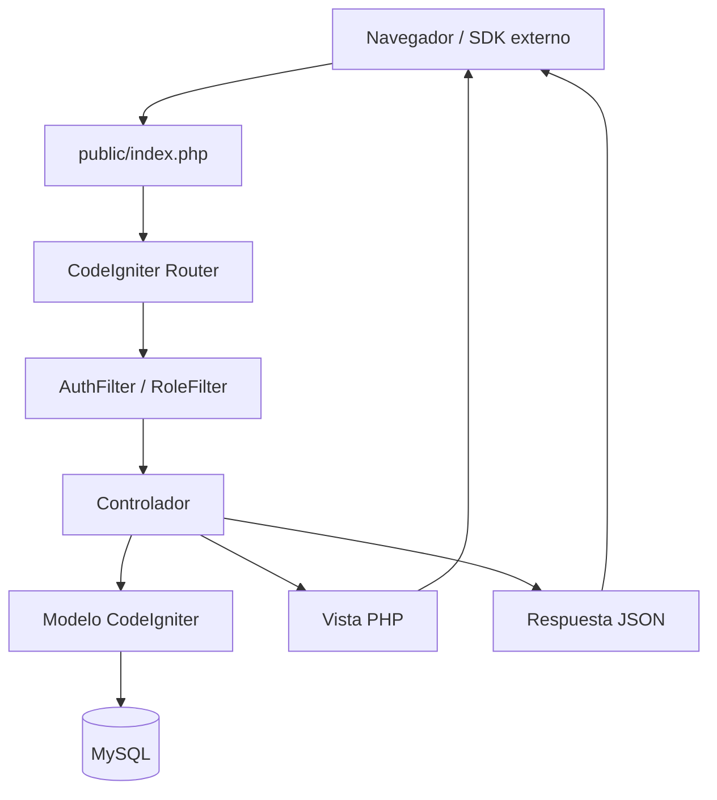
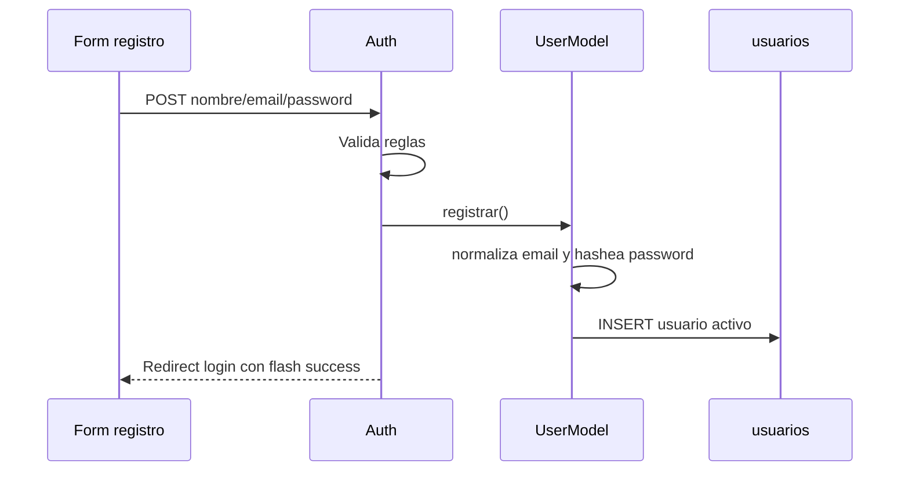
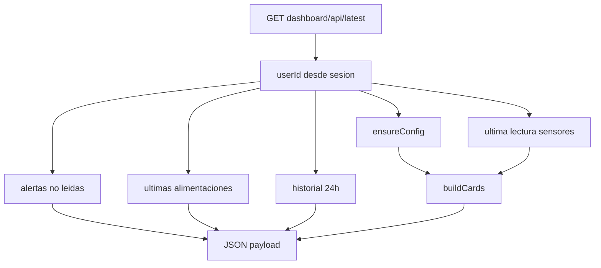
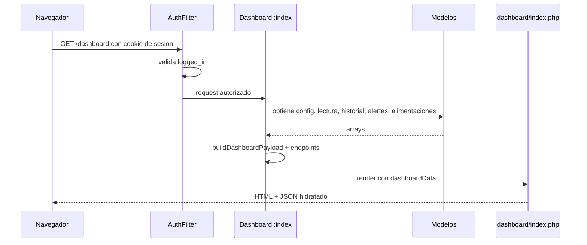
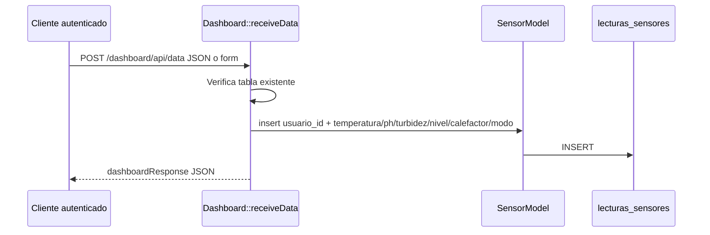
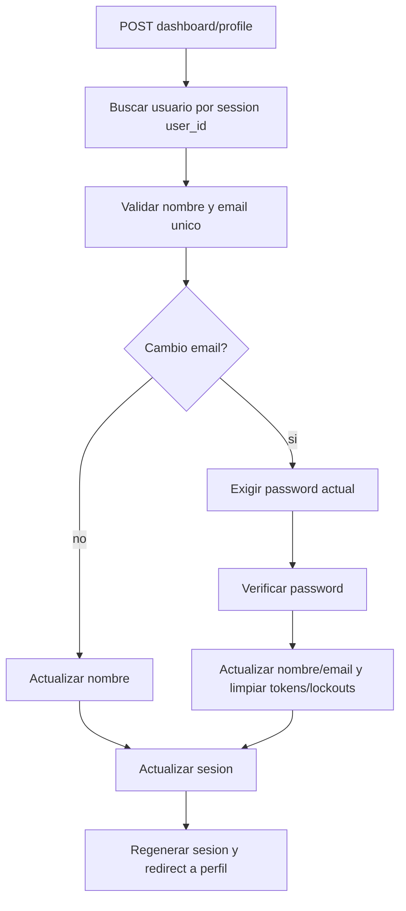
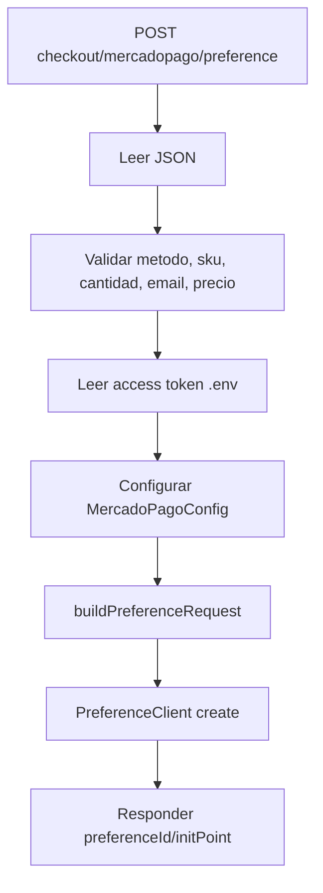
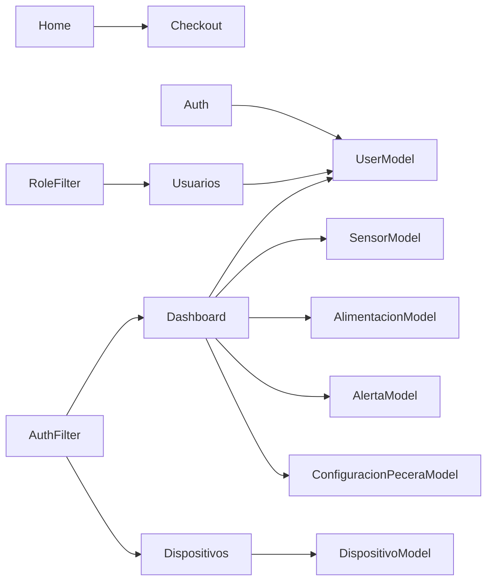

# BACKEND_DOCUMENTACION

## Resumen general

El backend de AquaControl esta construido sobre CodeIgniter 4 con arquitectura MVC. El punto de entrada es `public/index.php`, las rutas estan en `app/Config/Routes.php`, los controladores en `app/Controllers`, los modelos en `app/Models` y la estructura de base de datos en `app/Database/Migrations`.

La aplicacion combina:

- Sitio publico de producto y checkout.
- Autenticacion con sesiones.
- Panel IoT con lecturas de sensores, alertas, alimentaciones y configuracion de pecera.
- CRUD de dispositivos por usuario.
- Administracion de usuarios por rol.
- Integracion de checkout con Mercado Pago.

No existe una capa formal de servicios de dominio. La logica de negocio vive principalmente en controladores y modelos, usando servicios nativos de CodeIgniter como `session`, `cache`, `email`, `response` y `db_connect()`.

## Tecnologias y dependencias backend

| Dependencia | Version / origen | Uso |
| --- | --- | --- |
| PHP | `^8.2` | Runtime requerido. |
| CodeIgniter 4 | `^4.7` | Framework MVC, routing, filtros, modelos, migraciones, sesiones. |
| MySQLi | Configuracion default | Base de datos principal. |
| `mercadopago/dx-php` | `3.10.0` | SDK PHP para crear preferencias de Mercado Pago. |
| SMTP | Config `Email.php` / `.env` | Envio de recuperacion de contrasena. |
| PHPUnit | `^10.5.16` | Tests. Actualmente hay tests starter. |
| Faker / vfsStream | dev | Soporte de tests starter. |

## Arquitectura



Patrones usados:

- MVC server-side: controladores preparan datos y renderizan vistas.
- Active Record / Query Builder via modelos de CodeIgniter.
- Sesiones server-side con cookie `ci_session`.
- Respuestas mixtas: HTML para navegacion normal y JSON para dashboard/checkout.
- Configuracion sensible y comercial mediante `.env`.

## Estructura de carpetas backend

```text
app/
  Config/
    Routes.php
    Filters.php
    Database.php
    Email.php
    Security.php
    Session.php
    App.php
    ...
  Controllers/
    BaseController.php
    Home.php
    Auth.php
    Dashboard.php
    Checkout.php
    Dispositivos.php
    Usuarios.php
  Filters/
    AuthFilter.php
    RoleFilter.php
  Models/
    UserModel.php
    SensorModel.php
    AlimentacionModel.php
    AlertaModel.php
    ConfiguracionPeceraModel.php
    DispositivoModel.php
  Database/
    Migrations/
      2024-01-01-000001_CreateUsuariosTable.php
      2026-05-08-000002_CreateConfiguracionPeceraTable.php
      2026-05-29-000003_AddRolesAndLoginSecurityToUsuariosTable.php
      2026-05-29-000004_CreateDispositivosTable.php
  Views/
public/
  index.php
  test_email.php
writable/
  cache/
  logs/
  session/
vendor/
```

## Punto de entrada y configuracion

### `public/index.php`

Front controller de CodeIgniter:

- Verifica PHP >= 8.2.
- Define `FCPATH`.
- Carga `app/Config/Paths.php`.
- Inicia `CodeIgniter\Boot::bootWeb($paths)`.

Todo request web debe entrar por `public/index.php`.

### `composer.json`

Define:

- Proyecto tipo `codeigniter4/appstarter`.
- Autoload PSR-4:
  - `App\` -> `app/`,
  - `Config\` -> `app/Config/`.
- Script `composer test` -> `phpunit`.

### `app/Config/App.php`

Config base:

- `baseURL` por defecto `http://localhost:8080/`, sobreescribible en `.env`.
- `indexPage = index.php`.
- `defaultLocale = en`.
- `appTimezone = UTC`.
- `forceGlobalSecureRequests = false`.
- `CSPEnabled = false`.

### `app/Config/Database.php`

Conexion default:

- Driver `MySQLi`.
- Host `localhost`.
- Puerto `3306`.
- Credenciales y nombre de base normalmente sobreescritos desde `.env`.
- Charset `utf8mb4`.

Conexion de tests:

- SQLite en memoria.

### `app/Config/Email.php`

Fuerza protocolo SMTP:

- Host default Gmail.
- Puerto 587.
- Crypto TLS.
- Lee remitente, usuario, password y host desde `.env`.

Se usa en recuperacion de contrasena.

### `app/Config/Session.php`

Sesiones:

- Driver `FileHandler`.
- Cookie `ci_session`.
- Expiracion 7200 segundos.
- Save path `writable/session`.
- Regeneracion cada 300 segundos.

### `app/Config/Security.php`

Config CSRF:

- Proteccion por cookie.
- Cookie `csrf_cookie_name`.
- Header `X-CSRF-TOKEN`.
- Regenera token en cada submission.

Pero en `app/Config/Filters.php` el filtro `csrf` esta comentado en globals; por lo tanto los tokens renderizados por las vistas no se validan globalmente en el estado actual.

## Rutas y endpoints

Definidas en `app/Config/Routes.php`.

| Metodo | Ruta | Controlador | Filtro | Proposito |
| --- | --- | --- | --- | --- |
| GET | `/` | `Home::index` | publico | Landing y checkout. |
| POST | `/checkout/mercadopago/preference` | `Checkout::mercadoPagoPreference` | publico | Crear preferencia Mercado Pago. |
| GET | `/checkout/mercadopago/success` | `Checkout::mercadoPagoSuccess` | publico | Callback aprobado. |
| GET | `/checkout/mercadopago/failure` | `Checkout::mercadoPagoFailure` | publico | Callback fallido. |
| GET | `/checkout/mercadopago/pending` | `Checkout::mercadoPagoPending` | publico | Callback pendiente. |
| GET/POST | `/auth/register` | `Auth::register` | publico | Alta de usuario. |
| GET/POST | `/auth/login` | `Auth::login` | publico | Login. |
| GET | `/auth/logout` | `Auth::logout` | publico | Destruye sesion. |
| GET/POST | `/auth/recover` | `Auth::recover` | publico | Solicitud de recuperacion. |
| GET/POST | `/auth/reset/{token}` | `Auth::reset` | publico | Reset por token en URL. |
| GET/POST | `/auth/reset` | `Auth::reset` | publico | Reset por token POST/GET. |
| GET | `/dashboard` | `Dashboard::index` | `auth` | Panel principal. |
| GET | `/dashboard/history` | `Dashboard::history` | `auth` | Misma vista con seccion historial activa. |
| GET | `/dashboard/settings` | `Dashboard::settings` | `auth` | Misma vista con configuracion activa. |
| GET | `/dashboard/profile` | `Dashboard::profile` | `auth` | Misma vista con perfil activo. |
| GET | `/dashboard/api/latest` | `Dashboard::latest` | `auth` | Payload JSON actualizado. |
| POST | `/dashboard/api/data` | `Dashboard::receiveData` | `auth` | Inserta lectura de sensores. |
| POST | `/dashboard/profile` | `Dashboard::updateProfile` | `auth` | Actualiza nombre/email. |
| POST | `/dashboard/alerts/{id}/read` | `Dashboard::markAlertRead` | `auth` | Marca alerta leida. |
| POST | `/dashboard/control/feed` | `Dashboard::feedNow` | `auth` | Registra alimentacion manual. |
| POST | `/dashboard/control/vacation-toggle` | `Dashboard::toggleVacation` | `auth` | Alterna modo vacaciones. |
| POST | `/dashboard/control/target-temperature` | `Dashboard::updateTargetTemperature` | `auth` | Guarda temperatura objetivo. |
| GET | `/dispositivos` | `Dispositivos::index` | `auth` | Lista y alta de dispositivos. |
| POST | `/dispositivos/nuevo` | `Dispositivos::create` | `auth` | Crea dispositivo. |
| GET/POST | `/dispositivos/editar/{id}` | `Dispositivos::edit` | `auth` | Edita dispositivo. |
| POST | `/dispositivos/eliminar/{id}` | `Dispositivos::delete` | `auth` | Elimina dispositivo. |
| GET | `/usuarios` | `Usuarios::index` | `role:administrador` | Lista usuarios. |
| GET/POST | `/usuarios/editar/{id}` | `Usuarios::edit` | `role:administrador` | Edita usuario. |

Existe override 404 que renderiza `app/Views/errors/404.php`.

## Filtros / middlewares

### `app/Filters/AuthFilter.php`

Protege rutas autenticadas:

- Verifica `session()->get('logged_in')`.
- Si falta, setea flash `error` y redirige a `auth/login`.

Se aplica a grupos `dashboard` y `dispositivos`.

### `app/Filters/RoleFilter.php`

Protege rutas por rol:

- Primero exige `logged_in`.
- Lee roles permitidos desde argumentos, por ejemplo `role:administrador`.
- Compara con `session()->get('user_role')`.
- Si no coincide, redirige a dashboard con flash de error.

Se aplica al grupo `usuarios`.

### `app/Config/Filters.php`

Aliases relevantes:

- `auth` -> `App\Filters\AuthFilter`.
- `role` -> `App\Filters\RoleFilter`.
- `csrf`, `toolbar`, `honeypot`, `secureheaders`, `cors`, etc.

Observacion: `csrf`, `honeypot`, `invalidchars` y `secureheaders` no estan activos globalmente.

## Controladores

### `BaseController.php`

Extiende `CodeIgniter\Controller`. Actualmente no precarga helpers, modelos ni servicios. Sirve como base comun para todos los controladores.

### `Home.php`

Responsabilidad: renderizar landing y preparar configuracion de compra.

`index()`:

- Lee variables `commerce.*`, `mercadopago.*` y `paypal.*` desde `.env`.
- Calcula datos de producto:
  - sku,
  - nombre,
  - headline,
  - descripcion,
  - precio unitario,
  - moneda,
  - maximo de cantidad,
  - mensaje de entrega.
- Calcula datos de pago:
  - locale,
  - URL de preferencia Mercado Pago,
  - public key Mercado Pago,
  - configuracion PayPal.
- Renderiza `home/index` con assets de compra.

La logica de negocio es comercial: permite que el producto y el checkout se configuren sin tocar la vista.

### `Auth.php`

Responsabilidad: ciclo de vida de usuarios y sesiones.

Constantes:

- `MAX_LOGIN_ATTEMPTS = 5`.
- `LOGIN_LOCK_MINUTES = 15`.
- `PASSWORD_RULE`: minimo 8, minuscula, mayuscula, numero y caracter especial.

Metodos publicos:

- `register()`: GET muestra formulario; POST procesa alta.
- `login()`: GET muestra formulario; POST autentica.
- `logout()`: destruye sesion y redirige a login.
- `recover()`: GET muestra formulario; POST genera token y envia mail si el usuario existe.
- `reset($token)`: valida token, muestra formulario o actualiza password.

Flujo de registro:



Flujo de login:

- Valida email y password requeridos.
- Normaliza email.
- Revisa throttle cache por email + IP.
- Busca usuario activo por email.
- Si el usuario esta bloqueado por DB, rechaza.
- Verifica password con `password_verify`.
- Si falla, incrementa cache y contador DB.
- Si pasa, limpia intentos, setea sesion y regenera ID.

Datos de sesion:

```text
user_id
user_email
user_nombre
user_role
logged_in = true
```

Flujo de recuperacion:

- Valida email.
- Si existe usuario activo:
  - genera token aleatorio,
  - guarda hash SHA-256 del token,
  - guarda expiracion de 1 hora,
  - envia email HTML.
- Siempre responde con mensaje neutral para evitar enumeracion de cuentas.

### `Dashboard.php`

Responsabilidad: panel IoT, APIs del dashboard, perfil y acciones de control.

Modelos usados:

- `SensorModel`.
- `AlimentacionModel`.
- `AlertaModel`.
- `ConfiguracionPeceraModel`.
- `UserModel`.

Tambien usa `db_connect()` para verificar si existen tablas antes de consultar.

Constante `DEFAULT_CONFIG`:

- temperatura minima y maxima,
- pH minimo y maximo,
- temperatura objetivo,
- modo vacaciones.

Metodos de navegacion:

- `index()`: overview.
- `history()`: misma vista con historial activo.
- `settings()`: misma vista con configuracion activa.
- `profile()`: misma vista con perfil activo.

Metodos JSON / acciones:

- `latest()`: devuelve payload actualizado.
- `receiveData()`: inserta lectura de sensores.
- `markAlertRead($alertId)`: marca alerta no leida del usuario.
- `feedNow()`: inserta alimentacion manual.
- `toggleVacation()`: cambia `modo_vacaciones`.
- `updateTargetTemperature()`: guarda `temp_objetivo`.
- `updateProfile()`: actualiza nombre/email del usuario.

Payload principal:

```text
config
cards
alerts
feedings
charts
latestTimestamp
endpoints
userName
```

Logica de negocio central:

- `ensureConfig()` garantiza una configuracion por usuario o usa defaults si no hay tabla/registro.
- `buildCards()` convierte datos crudos en tarjetas legibles para UI:
  - temperatura con estado segun rango,
  - pH con estado segun rango,
  - nivel de agua OK/Bajo,
  - calefactor Encendido/Apagado,
  - ultima alimentacion,
  - modo vacaciones.
- `rangeStatus()` clasifica valores como `ok`, `warn`, `danger` o `neutral`.
- `fetchSensorHistory()` limita historial a ultimas 24 horas.
- `fetchAlerts()` trae hasta 5 alertas no leidas.
- `fetchFeedings()` trae ultimas 10 alimentaciones.

Ejemplo de procesamiento de `latest()`:



### `Checkout.php`

Responsabilidad: integracion de compra con Mercado Pago.

`mercadoPagoPreference()`:

- Lee JSON del request.
- Valida forma del pedido:
  - metodo `mercadopago`,
  - precio configurado,
  - sku correcto,
  - cantidad dentro del maximo,
  - email valido.
- Lee access token de `.env`.
- Configura SDK Mercado Pago.
- Crea preferencia con item, payer, back URLs, referencia externa, descriptor y metadata.
- Devuelve `preferenceId`, `initPoint` y `sandboxInitPoint`.

Callbacks:

- `mercadoPagoSuccess()`.
- `mercadoPagoFailure()`.
- `mercadoPagoPending()`.

Todos setean flash y redirigen al inicio con anchor.

Punto clave: no hay tabla de pedidos ni persistencia de transacciones. La preferencia se crea, pero no se guarda orden local ni se procesa webhook de confirmacion.

### `Dispositivos.php`

Responsabilidad: CRUD de dispositivos del usuario autenticado.

Logica:

- `index()` lista dispositivos del usuario actual.
- `create()` arma payload con `usuario_id` de sesion y datos del POST.
- `edit($id)` primero busca por `id` y `usuario_id`; si no coincide, redirige.
- `delete($id)` tambien exige pertenencia por usuario.

Tipos permitidos:

- `sensor`,
- `actuador`,
- `controlador`,
- `kit_iot`,
- `otro`.

### `Usuarios.php`

Responsabilidad: administracion de usuarios.

Solo accesible a administradores por `RoleFilter`.

Logica:

- `index()` lista usuarios por fecha de creacion descendente.
- `edit($id)` muestra formulario o procesa POST.
- `updateUser()` valida nombre, rol y password opcional.
- `wouldRemoveLastAdmin()` impide que el ultimo admin activo pierda su rol.
- Si el admin edita su propia cuenta, actualiza `user_nombre` y `user_role` en sesion.

## Modelos

### `UserModel.php`

Tabla: `usuarios`.

Campos permitidos:

```text
nombre, email, password, rol,
token_recuperacion, token_expira,
login_intentos, bloqueado_hasta,
activo, created_at, updated_at
```

Roles:

- `administrador`,
- `usuario`,
- `tecnico`.

Reglas:

- nombre requerido,
- email valido y unico,
- password fuerte,
- rol dentro de lista permitida.

Callbacks:

- `normalizeEmail`: lowercase + trim.
- `hashPassword`: bcrypt cost 12 en insert.
- `hashPasswordOnUpdate`: bcrypt cost 12 si cambia password.

Metodos de negocio:

- `findByEmail($email)`: solo usuarios activos.
- `verifyPassword($plain, $hash)`.
- `generarTokenRecuperacion($userId)`: token aleatorio, guarda hash y expiracion.
- `findByTokenValido($token)`: busca hash valido y activo; tambien tolera token plano legacy.
- `restablecerPassword($userId, $nuevaPassword)`.
- `registrar($datos)`: primer usuario queda admin; siguientes quedan usuario comun.
- `registrarIntentoFallido()`: contador DB y bloqueo temporal.
- `resetearSeguridadLogin()`.
- `estaBloqueado()` y `segundosBloqueoRestantes()`.
- `roleLabel()` e `isValidRole()`.

### `SensorModel.php`

Tabla: `lecturas_sensores`.

Campos:

```text
usuario_id, temperatura, ph, turbidez, nivel_agua,
calefactor, modo_vacaciones, created_at
```

Metodos:

- `ultimaLectura($userId)`: ultima por fecha.
- `historial($userId, $hours = 24)`: lecturas de las ultimas horas.

Representa la telemetria IoT del acuario.

### `AlimentacionModel.php`

Tabla: `alimentaciones`.

Campos:

```text
usuario_id, cantidad_gramos, tipo, created_at
```

Tipos segun migracion:

- `manual`,
- `automatica`,
- `vacaciones`.

Metodos:

- `ultimasPorUsuario($userId, $limit = 10)`.
- `ultimaPorUsuario($userId)`.

### `AlertaModel.php`

Tabla: `alertas`.

Campos:

```text
usuario_id, nivel, tipo, mensaje, leida, created_at
```

Metodos:

- `noLeidasPorUsuario($userId, $limit = 5)`.

Niveles:

- 1 aviso,
- 2 alerta,
- 3 critico.

### `ConfiguracionPeceraModel.php`

Tabla: `configuracion_pecera`.

Campos:

```text
usuario_id, temp_min, temp_max, ph_min, ph_max,
temp_objetivo, modo_vacaciones, created_at, updated_at
```

Metodo:

- `porUsuario($userId)`.

Relacionalmente es 1 a 1 con `usuarios` por unique key `usuario_id`.

### `DispositivoModel.php`

Tabla: `dispositivos`.

Campos:

```text
usuario_id, nombre, tipo, ubicacion, created_at, updated_at
```

Validaciones:

- usuario requerido,
- nombre requerido,
- tipo dentro de lista,
- ubicacion requerida.

Metodos:

- `porUsuario($userId)`.
- `buscarParaUsuario($deviceId, $userId)`.

## Base de datos

### Entidades y relaciones

```mermaid
erDiagram
    USUARIOS ||--o{ LECTURAS_SENSORES : registra
    USUARIOS ||--o{ ALIMENTACIONES : tiene
    USUARIOS ||--o{ ALERTAS : recibe
    USUARIOS ||--|| CONFIGURACION_PECERA : configura
    USUARIOS ||--o{ DISPOSITIVOS : posee

    USUARIOS {
        int id PK
        varchar nombre
        varchar email UK
        varchar password
        varchar rol
        varchar token_recuperacion
        datetime token_expira
        tinyint login_intentos
        datetime bloqueado_hasta
        tinyint activo
        datetime created_at
        datetime updated_at
    }

    LECTURAS_SENSORES {
        int id PK
        int usuario_id FK
        decimal temperatura
        decimal ph
        decimal turbidez
        tinyint nivel_agua
        tinyint calefactor
        tinyint modo_vacaciones
        datetime created_at
    }

    ALIMENTACIONES {
        int id PK
        int usuario_id FK
        decimal cantidad_gramos
        enum tipo
        datetime created_at
    }

    ALERTAS {
        int id PK
        int usuario_id FK
        tinyint nivel
        varchar tipo
        varchar mensaje
        tinyint leida
        datetime created_at
    }

    CONFIGURACION_PECERA {
        int id PK
        int usuario_id FK_UK
        decimal temp_min
        decimal temp_max
        decimal ph_min
        decimal ph_max
        decimal temp_objetivo
        tinyint modo_vacaciones
        datetime created_at
        datetime updated_at
    }

    DISPOSITIVOS {
        int id PK
        int usuario_id FK
        varchar nombre
        varchar tipo
        varchar ubicacion
        datetime created_at
        datetime updated_at
    }
```

### Migraciones

#### `2024-01-01-000001_CreateUsuariosTable.php`

Crea:

- `usuarios`.
- `lecturas_sensores`.
- `alimentaciones`.
- `alertas`.

Todas las tablas IoT tienen FK a `usuarios.id` con cascade update/delete.

#### `2026-05-08-000002_CreateConfiguracionPeceraTable.php`

Crea `configuracion_pecera`:

- Unique key en `usuario_id`.
- FK a `usuarios`.
- Defaults de temperatura, pH, objetivo y modo vacaciones.

#### `2026-05-29-000003_AddRolesAndLoginSecurityToUsuariosTable.php`

Agrega a `usuarios`:

- `rol`,
- `login_intentos`,
- `bloqueado_hasta`.

Ademas promueve el primer usuario existente a administrador si no hay admin.

#### `2026-05-29-000004_CreateDispositivosTable.php`

Crea `dispositivos` con FK a `usuarios`.

## Flujos de procesamiento

### Render inicial del dashboard



### Insercion de lectura de sensores



La ruta esta protegida por sesion. Para hardware IoT real haria falta un mecanismo de API key, token de dispositivo o firma; con la arquitectura actual el emisor debe tener cookie de sesion.

### Actualizacion de perfil



### Checkout Mercado Pago



## Autenticacion y autorizacion

### Autenticacion

El login es por email y password:

- Email se normaliza a lowercase.
- Password se almacena con bcrypt cost 12.
- Se usa `password_verify` para validar.
- Despues de login exitoso se llama `session()->regenerate(true)`.

### Lockout y throttling

Hay dos capas:

- Cache por email + IP:
  - clave hash `login_attempts_*`,
  - 5 intentos,
  - bloqueo 15 minutos.
- DB por usuario:
  - `login_intentos`,
  - `bloqueado_hasta`.

Si el usuario no existe, igual se registra throttle en cache por email+IP.

### Recuperacion de contrasena

- Genera token aleatorio de 32 bytes.
- Guarda SHA-256 del token.
- Expira en 1 hora.
- Email HTML con link `auth/reset/{token}`.
- Al resetear, limpia token, expiracion, intentos y bloqueo.

### Autorizacion

- Rutas `dashboard` y `dispositivos`: requieren `logged_in`.
- Rutas `usuarios`: requieren rol `administrador`.
- Dispositivos se consultan por `id` + `usuario_id`, evitando editar recursos de otros usuarios.
- Alertas se marcan leidas solo si pertenecen al usuario en sesion.

## Seguridad implementada

| Area | Estado actual |
| --- | --- |
| Passwords | bcrypt cost 12. |
| Sesion | Server-side file session, cookie HTTPOnly, SameSite Lax. |
| Regeneracion de sesion | Al login y al actualizar perfil. |
| Roles | `administrador`, `usuario`, `tecnico`. |
| Lockout login | Cache por email/IP y campos DB por usuario. |
| Tokens recovery | Token aleatorio, hash en DB, expiracion 1 hora. |
| CSRF | Configurado, tokens en vistas, pero filtro global inactivo. |
| CORS | Sin origen permitido por defecto; filtro no activo. |
| CSP | Desactivado en `App.php`. |
| Secure cookies | `secure = false`, apto local pero no ideal produccion. |
| Logout | GET `/auth/logout`, no POST. |

## Relaciones entre modulos



## Dependencias criticas y puntos de fallo

- Base de datos MySQL:
  - Si no corren migraciones, dashboard usa fallbacks en algunas lecturas, pero `receiveData()` devuelve 503 si falta `lecturas_sensores`.
- `.env`:
  - Define DB, SMTP, comercio y Mercado Pago. Credenciales incorrectas rompen login recovery, checkout o conexion DB.
- Mercado Pago:
  - `mercadopago.accessToken` es obligatorio para crear preferencia.
  - Fallos de API devuelven 502.
- SMTP:
  - Recovery depende de SMTP configurado.
  - El catch registra error pero la respuesta al usuario sigue siendo neutral.
- Sesiones en archivos:
  - Dependen de permisos en `writable/session`.
- Cache en archivos:
  - Throttle depende de `writable/cache`.
- SDKs externos:
  - La preferencia se genera con SDK PHP, pero el boton se monta con SDK JS externo.

## Tests

Existen tests starter:

- `tests/unit/HealthTest.php`: valida `APPPATH` y `baseURL`.
- `tests/database/ExampleDatabaseTest.php`: prueba modelo ejemplo del starter.
- `tests/session/ExampleSessionTest.php`: prueba basica de sesion.

No hay cobertura actual para:

- registro/login,
- lockout,
- recuperacion,
- dashboard payload,
- CRUD dispositivos,
- roles/admin,
- checkout Mercado Pago.

## Observaciones y mejoras posibles

- Activar y ajustar CSRF. Las vistas incluyen `csrf_field()`, pero el filtro `csrf` no esta activo. Si se activa, tambien hay que enviar token en `dashboard.js` y `purchase.js`.
- Cambiar logout a POST protegido por CSRF; actualmente es GET.
- Agregar autenticacion propia para `/dashboard/api/data`. La ruta hoy depende de sesion web, poco practica para ESP32 u otros dispositivos IoT.
- Validar rangos numericos en backend para sensores, gramos y temperatura objetivo. Hoy se castea/inserta con validacion limitada.
- Crear migracion/modelo de pedidos o transacciones. Mercado Pago crea preferencias, pero no se persisten ordenes locales ni se procesan webhooks.
- Implementar endpoints PayPal o retirar opcion del frontend hasta que exista backend.
- Eliminar o proteger `public/test_email.php`; es un archivo de prueba publico y no deberia quedar expuesto.
- Revisar secretos en `.env` y rotarlos si fueron compartidos o quedaron versionados. La documentacion no debe incluir valores de credenciales.
- Activar `secureheaders` y CSP en produccion, ajustando fuentes externas necesarias: Chart.js, Mercado Pago, PayPal y Google Fonts.
- Usar cookies `secure = true` y `forceGlobalSecureRequests = true` en HTTPS productivo.
- `Auth::findByTokenValido()` acepta token plano ademas de hash, util para compatibilidad pero menos estricto.
- `Dashboard::fromTable()` captura excepciones y devuelve fallback; mejora la UX pero puede ocultar errores de datos o migraciones.
- `Checkout::redirectWithFlash()` redirige a `/#comprar`, mientras la vista actual usa `#checkout`.
- `welcome_message.php` y tests ejemplo son remanentes del starter.
- Hay caracteres con mojibake en comentarios y textos visibles; conviene normalizar a UTF-8.
