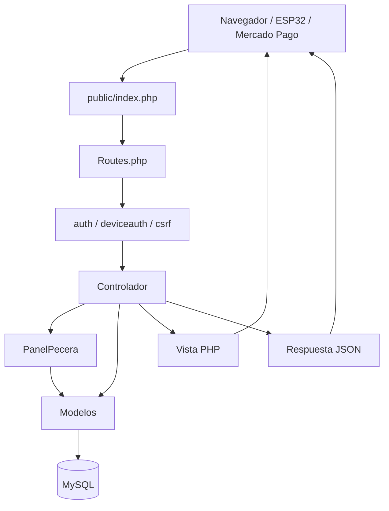
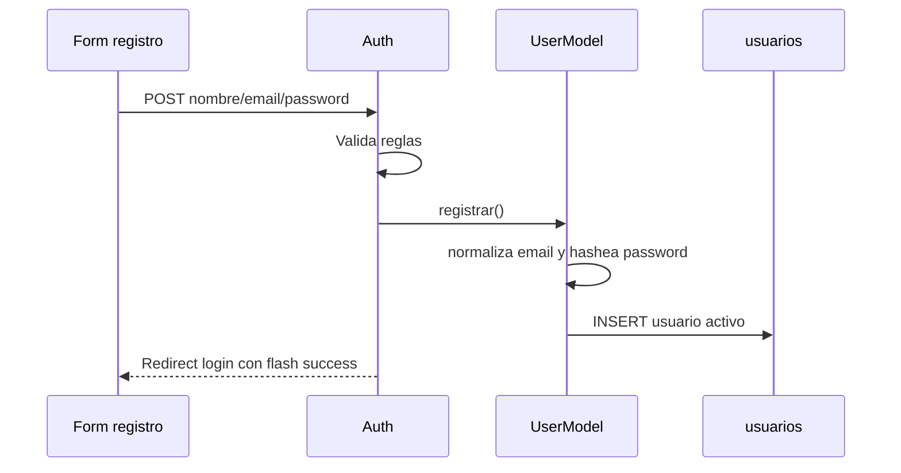
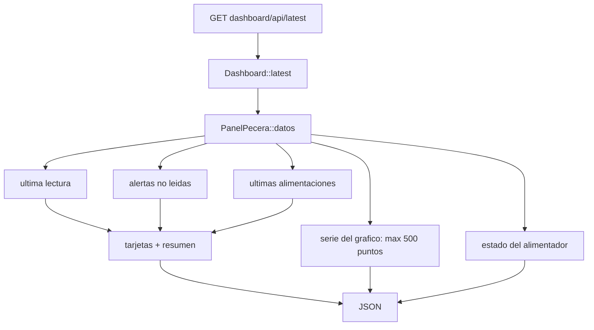
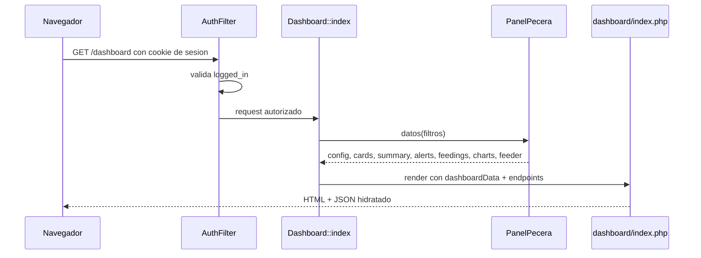
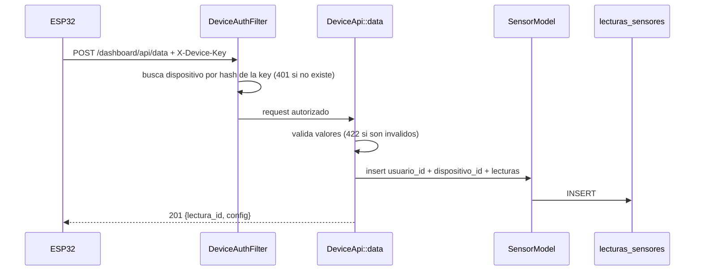
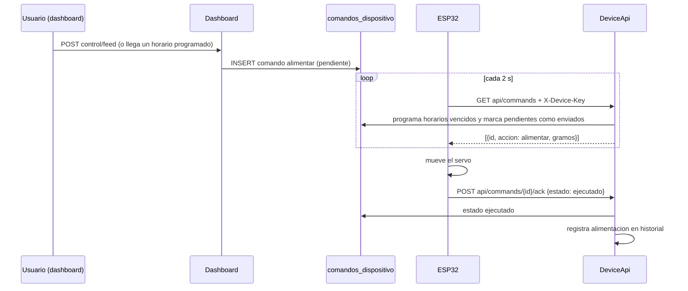
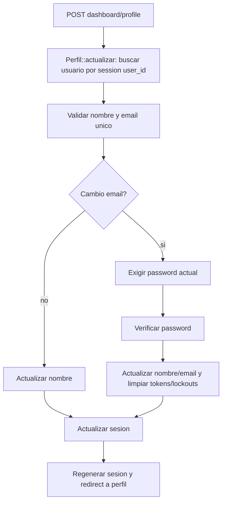
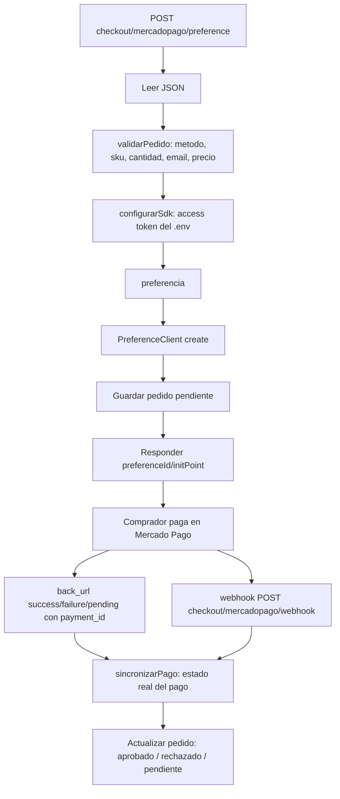
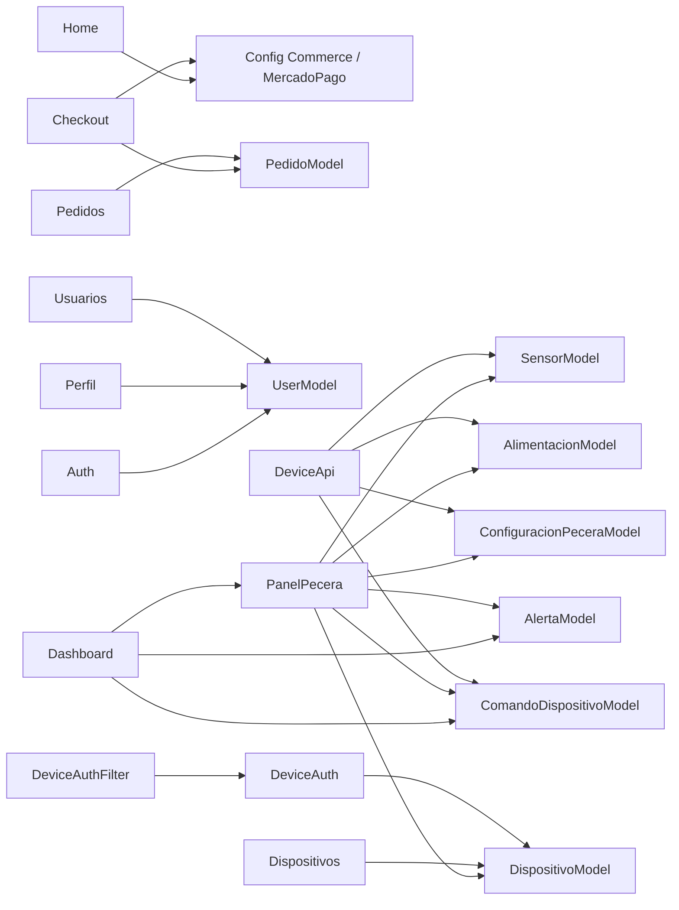

# BACKEND_DOCUMENTACION

## Resumen general

El backend de AquaControl esta construido sobre CodeIgniter 4 con arquitectura MVC. El punto de entrada es `public/index.php`, las rutas estan en `app/Config/Routes.php`, los controladores en `app/Controllers`, los modelos en `app/Models` y la estructura de base de datos en `app/Database/Migrations`.

La aplicacion combina:

- Sitio publico de producto y checkout.
- Autenticacion con sesiones.
- Panel IoT con lecturas de sensores, alertas, alimentaciones y configuracion de pecera.
- CRUD de dispositivos por usuario, con API key propia para cada ESP32.
- API para dispositivos IoT (ingesta de lecturas y cola de comandos del alimentador con servo).
- Alimentacion manual y programada por horario.
- Administracion de usuarios y pedidos por rol.
- Integracion de checkout con Mercado Pago, con registro de pedidos y webhook.

Como se reparte el trabajo:

- **Controladores**: reciben el pedido, validan lo que llega y deciden que responder. Son cortos.
- **Modelos**: una clase por tabla, con las consultas a la base.
- **`App\Libraries\PanelPecera`**: arma todo lo que muestra el panel (tarjetas, grafico, alertas, estado del alimentador). Lo usan la pagina y las respuestas JSON, asi los textos se calculan en un solo lugar.
- **Config propia** (`Commerce`, `MercadoPago`, `Feeding`): valores que se leen de `.env`.

## Tecnologias y dependencias backend

| Dependencia | Version / origen | Uso |
| --- | --- | --- |
| PHP | `^8.2` | Runtime requerido. |
| CodeIgniter 4 | `^4.7` | Framework MVC, routing, filtros, modelos, migraciones, sesiones. |
| MySQLi | Configuracion default | Base de datos principal (MariaDB 10.4 de XAMPP). |
| `mercadopago/dx-php` | `3.10.0` | SDK PHP para crear preferencias de Mercado Pago. |
| SMTP | Config `Email.php` / `.env` | Envio de recuperacion de contrasena. |
| PHPUnit | `^10.5.16` | Tests. Actualmente solo estan los de ejemplo del starter. |

## Arquitectura


```mermaid
flowchart TD
    Client[Navegador / ESP32 / Mercado Pago] --> Front[public/index.php]
    Front --> Router[Routes.php]
    Router --> Filters[auth / deviceauth / csrf]
    Filters --> Controller[Controlador]
    Controller --> Panel[PanelPecera]
    Controller --> Model[Modelos]
    Panel --> Model
    Model --> DB[(MySQL)]
    Controller --> View[Vista PHP]
    Controller --> JSON[Respuesta JSON]
    View --> Client
    JSON --> Client
```

Patrones usados:

- MVC server-side: controladores preparan datos y renderizan vistas.
- Active Record / Query Builder via modelos de CodeIgniter.
- Sesiones server-side con cookie `ci_session`.
- Respuestas mixtas: HTML para navegacion normal y JSON para dashboard/checkout/ESP32.
- Configuracion sensible y comercial mediante `.env`.

## Estructura de carpetas backend

```text
app/
  Commands/
    Servidor.php              (php spark servir)
  Config/
    Routes.php                (que controlador atiende cada direccion)
    Filters.php               (filtros globales y alias)
    Commerce.php              (producto y precio: commerce.* del .env)
    MercadoPago.php           (credenciales: mercadopago.* del .env)
    Feeding.php               (reglas del alimentador)
    Toolbar.php               (barra de depuracion: apagada salvo toolbar.activo = true)
    App.php, Database.php, Email.php, Security.php, Session.php, ...
  Controllers/
    BaseController.php        (userId())
    Home.php                  (portada)
    Auth.php                  (registro, login, logout, recuperar contrasena)
    Dashboard.php             (panel de la pecera y sus acciones)
    Perfil.php                (formulario "Mi cuenta")
    DeviceApi.php             (API del ESP32)
    Dispositivos.php          (ABM de dispositivos y API keys)
    Usuarios.php              (administracion de cuentas)
    Pedidos.php               (listado de pedidos)
    Checkout.php              (Mercado Pago)
  Filters/
    AuthFilter.php            (sesion iniciada y, opcionalmente, rol)
    DeviceAuthFilter.php      (API key del ESP32)
    CsrfTokenHeaderFilter.php (devuelve el token CSRF nuevo en un header)
  Helpers/
    formulario_helper.php     (error_campo() y clase_error() para las vistas)
  Libraries/
    PanelPecera.php           (datos del panel)
    DeviceAuth.php            (busca el dispositivo por su API key)
  Models/
    UserModel.php
    SensorModel.php
    AlimentacionModel.php
    AlertaModel.php
    ComandoDispositivoModel.php
    ConfiguracionPeceraModel.php
    DispositivoModel.php
    PedidoModel.php
  Database/
    Migrations/
      2024-01-01-000001_CreateUsuariosTable.php
      2026-05-08-000002_CreateConfiguracionPeceraTable.php
      2026-05-29-000003_AddRolesAndLoginSecurityToUsuariosTable.php
      2026-05-29-000004_CreateDispositivosTable.php
      2026-09-23-000005_AddApiKeyToDispositivosTable.php
      2026-09-24-000006_CreateComandosDispositivoTable.php
      2026-09-24-000007_ConvertirFechasAHoraArgentina.php
      2026-09-24-000008_CreatePedidosTable.php
      2026-10-01-000009_TablasDeLecturasEIndices.php
  Views/                      (ver FRONTEND_DOCUMENTACION.md)
firmware/
  aquacontrol_esp32/aquacontrol_esp32.ino           (modo WiFi: el que se usa hoy)
  aquacontrol_esp32/secrets.example.h               (copiar como secrets.h con WiFi, IP y API key; no se versiona)
  aquacontrol_esp32_usb/aquacontrol_esp32_usb.ino   (alternativa por cable USB)
  puente_usb.ps1                                    (puente PC <-> pagina, solo para el modo USB)
  config.example.ps1                                (copiar como config.local.ps1 con la API key; no se versiona)
  cargar_firmware.ps1                               (compila y carga el firmware; espera BOOT + EN)
iniciar_aquacontrol.bat                             (levanta MySQL y la pagina; con MODO=usb tambien el puente)
.env.example                                        (plantilla del .env sin credenciales)
public/
  index.php
writable/
  cache/
  logs/
  session/
vendor/
```

## Servidor de desarrollo

### `php spark servir` (`app/Commands/Servidor.php`)

Es el comando para levantar la pagina (lo usa `iniciar_aquacontrol.bat`). Reemplaza a `php spark serve` por dos motivos de rendimiento:

- **IPv4 + IPv6.** Arranca dos procesos `php -S`, uno en `0.0.0.0:8080` y otro en `[::]:8080`. En Windows, `localhost` prueba primero IPv6; con un servidor solo IPv4 cada pedido esperaba unos 0,2 s antes de conectar. Ademas el navegador y el ESP32 dejan de hacer fila en un unico proceso.
- **OPcache.** PHP guarda el codigo ya compilado entre pedidos (`opcache.enable_cli=1`). Con `opcache.revalidate_freq=0` revisa los archivos en cada pedido, asi que los cambios se ven al recargar.

Antes de arrancar cierra los servidores anteriores de este mismo proyecto. Acepta `--puerto 8081`.

Al escuchar en `0.0.0.0` la pagina se puede abrir desde otro equipo de la red con la IP de la PC. `Config\App::__construct()` agrega ese nombre a `allowedHostnames` (solo si es `localhost`, `127.0.0.1` o una IP de esta PC) para que los links y los estilos usen la misma direccion.

## Punto de entrada y configuracion

### `public/index.php`

Front controller de CodeIgniter:

- Verifica PHP >= 8.2.
- Define `FCPATH`.
- Carga `app/Config/Paths.php`.
- Inicia `CodeIgniter\Boot::bootWeb($paths)`.

Todo request web debe entrar por `public/index.php`.

### `composer.json`

Define:

- Proyecto tipo `codeigniter4/appstarter`.
- Autoload PSR-4:
  - `App\` -> `app/`,
  - `Config\` -> `app/Config/`.
- Script `composer test` -> `phpunit`.

### `app/Config/App.php`

Config base:

- `baseURL` por defecto `http://localhost:8080/`, sobreescribible en `.env`.
- `indexPage = ''`: las direcciones no llevan `index.php` (lo resuelven `spark servir` y el `.htaccess`).
- `appTimezone = America/Argentina/Buenos_Aires`. Todas las fechas se guardan y muestran en hora Argentina (la migracion `ConvertirFechasAHoraArgentina` corrigio los datos que estaban en UTC).
- `forceGlobalSecureRequests = false`.
- `CSPEnabled = false`.

### `app/Config/Autoload.php`

Carga en todas las paginas los helpers `form` (para `set_value()` y `set_checkbox()`) y `formulario` (propio: `error_campo()` y `clase_error()`).

### `app/Config/Toolbar.php`

`public bool $activo = false`. La barra de depuracion de CodeIgniter agregaba unos 10.000 elementos ocultos a cada pagina del panel; ahora solo se carga si `.env` tiene `toolbar.activo = true` (lo miran `Config\Filters` y `Config\Events`).

### `app/Config/Logger.php`

En desarrollo registra hasta nivel 5 (avisos); en produccion hasta 4 (errores).

### `app/Config/Database.php`

Conexion default:

- Driver `MySQLi`.
- Host `localhost`.
- Puerto `3306`.
- Credenciales y nombre de base normalmente sobreescritos desde `.env`.
- Charset `utf8mb4`.

Conexion de tests:

- SQLite en memoria.

### `app/Config/Email.php`

Fuerza protocolo SMTP:

- Host default Gmail.
- Puerto 587.
- Crypto TLS.
- Lee remitente, usuario, password y host desde `.env`.

Se usa en recuperacion de contrasena.

### `app/Config/Session.php`

Sesiones:

- Driver `FileHandler`.
- Cookie `ci_session`.
- Expiracion 7200 segundos.
- Save path `writable/session`.
- Regeneracion cada 300 segundos.

### `app/Config/Security.php`

Config CSRF:

- Proteccion por cookie.
- Cookie `csrf_cookie_name`.
- Header `X-CSRF-TOKEN`.
- Regenera token en cada submission.

El filtro `csrf` esta activo globalmente (ver `Filters.php`). Los formularios envian `csrf_field()` y las llamadas AJAX mandan el header `X-CSRF-TOKEN` leido de `<meta name="csrf-token">`. Como el token se regenera en cada POST, el filtro `csrfheader` devuelve el token nuevo en el header de respuesta y `window.AquaCsrf` (en `aqua.js`) lo actualiza en la pagina.

### `app/Config/Commerce.php`

Datos de la tienda, leidos de las lineas `commerce.*` del `.env`: `productSku`, `productName`, `productDescription`, `unitPrice`, `currency`, `maxQuantity`, `deliveryMessage`, `locale`.

- `precio()`: el precio como numero, o `null` si no esta configurado (la portada muestra "Consultar").
- `moneda()`: codigo de moneda en mayusculas.
- `cantidadMaxima()`: maximo de unidades por pedido (minimo 1).

### `app/Config/MercadoPago.php`

Credenciales y opciones, leidas de `mercadopago.*`: `accessToken`, `publicKey`, `webhookSecret`, `runtime`, `notificationUrl`, `installments`, `autoReturn`, `statementDescriptor`, `preferenceUrl`.

- `esLocal()`: `runtime = local` (desarrollo).
- `usarAutoReturn()`: si Mercado Pago debe volver solo a la pagina al aprobar el pago. Si `autoReturn` no esta en `.env`, se usa en produccion y no en `local`.

### `app/Config/Feeding.php`

Configuracion del alimentador automatico:

- `timezone`: zona en la que se interpretan los horarios (`America/Argentina/Buenos_Aires`).
- `scheduleWindowMinutes` (30): margen despues de la hora programada para disparar la racion si el ESP32 estuvo offline.
- `manualCommandTtlMinutes` (1): tiempo que espera un "Alimentar ahora" antes de expirar. Ademas, "Alimentar ahora" se rechaza si el ESP32 no esta en linea.
- `onlineThresholdSeconds` (30): sin contacto por mas tiempo, el dispositivo se muestra offline.
- `minGrams` / `maxGrams`: limites de gramos por racion.

## Rutas y endpoints

Definidas en `app/Config/Routes.php`.

| Metodo | Ruta | Controlador | Filtro | Proposito |
| --- | --- | --- | --- | --- |
| GET | `/` | `Home::index` | publico | Landing y checkout. |
| POST | `/checkout/mercadopago/preference` | `Checkout::mercadoPagoPreference` | publico | Crear preferencia Mercado Pago. |
| GET | `/checkout/mercadopago/success` | `Checkout::mercadoPagoSuccess` | publico | Callback aprobado. |
| GET | `/checkout/mercadopago/failure` | `Checkout::mercadoPagoFailure` | publico | Callback fallido. |
| GET | `/checkout/mercadopago/pending` | `Checkout::mercadoPagoPending` | publico | Callback pendiente. |
| POST | `/checkout/mercadopago/webhook` | `Checkout::mercadoPagoWebhook` | publico, sin CSRF | Notificaciones de Mercado Pago. |
| GET/POST | `/auth/register` | `Auth::register` | publico | Alta de usuario. |
| GET/POST | `/auth/login` | `Auth::login` | publico | Login. |
| POST | `/auth/logout` | `Auth::logout` | publico + CSRF | Destruye sesion. |
| GET/POST | `/auth/recover` | `Auth::recover` | publico | Solicitud de recuperacion. |
| GET/POST | `/auth/reset/{token}` | `Auth::reset` | publico | Reset por token en URL. |
| GET/POST | `/auth/reset` | `Auth::reset` | publico | Reset por token POST/GET. |
| POST | `/dashboard/api/data` | `DeviceApi::data` | `deviceauth`, sin CSRF | El ESP32 envia lecturas con su API key. |
| GET | `/dashboard/api/commands` | `DeviceApi::commands` | `deviceauth` | El ESP32 retira comandos pendientes (alimentar). |
| POST | `/dashboard/api/commands/{id}/ack` | `DeviceApi::ack` | `deviceauth`, sin CSRF | El ESP32 confirma `ejecutado` o `fallido`. |
| GET | `/dashboard` | `Dashboard::index` | `auth` | Panel principal. |
| GET | `/dashboard/history` | `Dashboard::history` | `auth` | Misma vista con historial activo. Acepta `?desde=AAAA-MM-DD&hasta=AAAA-MM-DD&dispositivo={id}`. |
| GET | `/dashboard/settings` | `Dashboard::settings` | `auth` | Misma vista con configuracion activa. |
| GET | `/dashboard/profile` | `Dashboard::profile` | `auth` | Misma vista con perfil activo. |
| POST | `/dashboard/profile` | `Perfil::actualizar` | `auth` | Actualiza nombre/email. |
| GET | `/dashboard/api/latest` | `Dashboard::latest` | `auth` | Payload JSON actualizado (respeta los filtros del historial). |
| POST | `/dashboard/alerts/{id}/read` | `Dashboard::markAlertRead` | `auth` | Marca alerta leida. |
| POST | `/dashboard/control/feed` | `Dashboard::feedNow` | `auth` | Encola la orden de alimentar para el ESP32. |
| POST | `/dashboard/control/vacation-toggle` | `Dashboard::toggleVacation` | `auth` | Alterna modo vacaciones. |
| POST | `/dashboard/control/target-temperature` | `Dashboard::updateTargetTemperature` | `auth` | Guarda temperatura objetivo. |
| POST | `/dashboard/control/feeding-schedule` | `Dashboard::updateFeedingSchedule` | `auth` | Guarda horarios y gramos por racion. |
| GET | `/dispositivos` | `Dispositivos::index` | `auth` | Lista y alta de dispositivos. |
| POST | `/dispositivos/nuevo` | `Dispositivos::create` | `auth` | Crea dispositivo. |
| GET/POST | `/dispositivos/editar/{id}` | `Dispositivos::edit` | `auth` | Edita dispositivo. |
| POST | `/dispositivos/eliminar/{id}` | `Dispositivos::delete` | `auth` | Elimina dispositivo. |
| POST | `/dispositivos/api-key/{id}` | `Dispositivos::generateApiKey` | `auth` | Genera o regenera la API key (se muestra una sola vez). |
| POST | `/dispositivos/api-key/{id}/revocar` | `Dispositivos::revokeApiKey` | `auth` | Revoca la API key. |
| GET | `/usuarios` | `Usuarios::index` | `auth:administrador` | Lista usuarios. |
| GET/POST | `/usuarios/editar/{id}` | `Usuarios::edit` | `auth:administrador` | Edita usuario. |
| GET | `/pedidos` | `Pedidos::index` | `auth:administrador` | Lista pedidos de la tienda (`?estado=` filtra). |

Existe override 404 que renderiza `app/Views/errors/404.php`.

Ojo con dos direcciones parecidas: `dashboard/api/latest` es del panel (sesion web), mientras que `dashboard/api/data` y `dashboard/api/commands` son del ESP32 (API key).

## Filtros / middlewares

### `app/Filters/AuthFilter.php`

Protege las paginas que requieren iniciar sesion:

- Verifica `session()->get('logged_in')`. Si falta, setea flash `error` y redirige a `auth/login`.
- Si la ruta indica roles (`auth:administrador`, o varios: `auth:administrador,tecnico`), compara con `session()->get('user_role')`. Si no coincide, redirige al panel con un mensaje de error.

Se aplica a los grupos `dashboard` y `dispositivos` (cualquier usuario) y a `usuarios` y `pedidos` (solo administradores).

### `app/Filters/DeviceAuthFilter.php`

Protege la API de dispositivos, independiente de la sesion web:

- Lee la API key del header `X-Device-Key` o `Authorization: Bearer <key>`.
- Busca el dispositivo por el hash SHA-256 de la key (`App\Libraries\DeviceAuth`, servicio compartido `service('deviceAuth')`) y registra `ultima_conexion`.
- Sin key valida responde `401` JSON. El controlador obtiene el dispositivo con `service('deviceAuth')->device()`.

### `app/Filters/CsrfTokenHeaderFilter.php`

Filtro `after` global: agrega el header `X-CSRF-TOKEN` con el token vigente para que el JS lo renueve tras cada POST.

### `app/Config/Filters.php`

Aliases propios:

- `auth` -> `App\Filters\AuthFilter`.
- `deviceauth` -> `App\Filters\DeviceAuthFilter`.
- `csrfheader` -> `App\Filters\CsrfTokenHeaderFilter`.

Globales activos: `csrf` (before) y `csrfheader` (after), excepto en las rutas de la constante `SIN_CSRF` (`dashboard/api/data`, `dashboard/api/commands*` y `checkout/mercadopago/webhook`), que no usan sesion de navegador. El filtro `toolbar` solo se agrega si la barra esta activada. `honeypot`, `invalidchars` y `secureheaders` siguen inactivos.

## Controladores

### `BaseController.php`

Extiende `CodeIgniter\Controller`. Solo agrega `userId()`: el id del usuario con sesion iniciada.

### `Home.php`

Responsabilidad: renderizar la portada con el formulario de compra.

`index()` lee `Config\Commerce` y `Config\MercadoPago` y pasa dos cosas a la vista `home/index`:

- `producto`: sku, nombre, descripcion, precio, moneda, cantidad maxima, mensaje de entrega y el precio ya formateado para la tarjeta y el resumen.
- `compra`: lo que necesita `purchase.js` (producto, locale, public key y URL para crear la preferencia). Se imprime como JSON en la pagina.

Mercado Pago es el unico medio de pago.

### `Auth.php`

Responsabilidad: ciclo de vida de usuarios y sesiones.

Constantes:

- `MAX_LOGIN_ATTEMPTS = 5`.
- `LOGIN_LOCK_MINUTES = 15`.

La regla de contrasena segura esta en `UserModel::PASSWORD_RULE` (minimo 8, minuscula, mayuscula, numero y caracter especial) y la comparten registro, reset y la edicion de usuarios.

Metodos publicos:

- `register()`: GET muestra formulario; POST procesa alta.
- `login()`: GET muestra formulario; POST autentica.
- `logout()`: solo POST con token CSRF; destruye sesion y redirige a login.
- `recover()`: GET muestra formulario; POST genera token y envia mail si el usuario existe.
- `reset($token)`: valida token, muestra formulario o actualiza password.

Privados: `demasiadosIntentos()`, `anotarIntentoFallido()` y `claveIntentos()` (freno por email + IP en la cache), `volverAlLogin()` y `enviarEmailRecuperacion()` (usa la vista `emails/recuperar_contrasena`).

Flujo de registro:


```mermaid
sequenceDiagram
    participant F as Form registro
    participant A as Auth
    participant U as UserModel
    participant DB as usuarios
    F->>A: POST nombre/email/password
    A->>A: Valida reglas
    A->>U: registrar()
    U->>U: normaliza email y hashea password
    U->>DB: INSERT usuario activo
    A-->>F: Redirect login con flash success
```

Flujo de login:

- Valida email y password requeridos.
- Normaliza email.
- Revisa throttle cache por email + IP.
- Busca usuario activo por email.
- Si el usuario esta bloqueado por DB, rechaza.
- Verifica password con `password_verify`.
- Si falla, incrementa cache y contador DB.
- Si pasa, limpia intentos, setea sesion y regenera ID.

Datos de sesion:

```text
user_id
user_email
user_nombre
user_role
logged_in = true
```

Flujo de recuperacion:

- Valida email.
- Si existe usuario activo:
  - genera token aleatorio,
  - guarda hash SHA-256 del token,
  - guarda expiracion de 1 hora,
  - envia email HTML.
- Siempre responde con mensaje neutral para evitar enumeracion de cuentas.

### `Dashboard.php`

Responsabilidad: las cuatro paginas del panel y sus acciones. Todo el calculo de datos esta en `PanelPecera`; el controlador solo valida y responde.

Paginas (las cuatro llaman a `pagina($seccion)` y usan la misma vista):

- `index()`: panel principal.
- `history()`: historial.
- `settings()`: configuracion.
- `profile()`: mi cuenta.

Acciones (responden el JSON del panel actualizado, para que `dashboard.js` redibuje sin recargar):

- `latest()`: datos actualizados (con los filtros del historial de la query string).
- `markAlertRead($alertId)`: marca una alerta del usuario como leida.
- `feedNow()`: encola un comando `alimentar` para el ESP32 (no registra la alimentacion: eso ocurre cuando el dispositivo confirma). Responde `422` si los gramos estan fuera de rango y `409` si no hay alimentador con API key, si esta desconectado o si ya hay una orden en curso.
- `updateFeedingSchedule()`: guarda `hora_alim_1`, `hora_alim_2` (vacios = desactivado) y `cantidad_alim_gramos`.
- `toggleVacation()`: cambia `modo_vacaciones`.
- `updateTargetTemperature()`: guarda `temp_objetivo`.

Privados: `panel()` (crea `PanelPecera` una sola vez), `filtros()`, `pagina()`, `endpoints()`, `respuesta()` y `error()`.

### `Perfil.php`

`actualizar()` atiende el formulario "Mi cuenta" (`POST dashboard/profile`): cambia nombre y email. Para cambiar el email exige la contrasena actual; al cambiarlo se anulan los enlaces de recuperacion pendientes y los bloqueos por intentos. Si hay errores vuelve al formulario con los datos que se habian escrito.

### `App\Libraries\PanelPecera`

Se crea con el id del usuario (`new PanelPecera($userId)`).

Metodos publicos:

- `config()` / `guardarConfig($cambios)`: configuracion de la pecera (con valores por defecto si el usuario todavia no guardo nada).
- `dispositivos()`, `alimentadores()`, `alimentadorEnLinea()`, `alimentacionPendiente()`.
- `filtrosHistorial($desde, $hasta, $deviceId)`: valida los filtros de la URL. Sin rango se muestran las ultimas 24 h.
- `textoRango($filtros)`: texto del rango, por ejemplo `24 h` o `29/09 - 01/10/2026 · ESP32 Pecera`.
- `datos($filtros)`: todo lo que muestra el panel.

`datos()` devuelve:

```text
config            configuracion de la pecera
cards             temperature, ph, waterLevel, heater, lastFeeding, vacationMode
                  (cada una con value, status y meta)
summary           alertsCount, alertsMeta, health, waterTitle, feedingTitle,
                  feedingMeta, vacationTitle, syncText
alerts            hasta 5 alertas sin leer
feedings          ultimas 10 alimentaciones (con fecha y tipoTexto listos para mostrar)
charts            labels, temperature, ph, count
feeder            hasDevice, online, pending, statusLevel, statusText, lastText, scheduleText
latestTimestamp   fecha de la ultima lectura
```

El controlador le suma `userName` y `endpoints` (las direcciones que usa `dashboard.js`).

Logica central:

- `tarjetas()` convierte la ultima lectura en textos legibles; `estadoSegunRango()` clasifica cada valor como `ok`, `warn`, `danger` o `neutral`.
- `resumen()` calcula el "Estado del ecosistema" (%) promediando el puntaje de cada tarjeta y restando 6 puntos por alerta sin leer.
- `grafico()` pide la serie a `SensorModel::serieParaGrafico()` con un maximo de 500 puntos.
- `estadoAlimentador()` arma el estado del alimentador (conectado, offline, orden en curso, ultima orden, horarios).


```mermaid
flowchart TD
    A[GET dashboard/api/latest] --> B[Dashboard::latest]
    B --> C[PanelPecera::datos]
    C --> D[ultima lectura]
    C --> E[alertas no leidas]
    C --> F[ultimas alimentaciones]
    C --> G[serie del grafico: max 500 puntos]
    C --> H[estado del alimentador]
    D --> I[tarjetas + resumen]
    E --> I
    F --> I
    I --> J[JSON]
    G --> J
    H --> J
```

### `Checkout.php`

Responsabilidad: integracion de compra con Mercado Pago.

`mercadoPagoPreference()`:

- Lee JSON del request.
- Valida forma del pedido (`validarPedido()`):
  - metodo `mercadopago`,
  - precio configurado,
  - sku correcto,
  - cantidad dentro del maximo,
  - email valido.
- Configura el SDK con el access token (`configurarSdk()`).
- Crea preferencia con item, payer, back URLs, referencia externa, descriptor y metadata (`preferencia()`).
- Guarda el pedido en `pedidos` con estado `pendiente`, la referencia externa y el id de preferencia.
- Devuelve `preferenceId`, `initPoint` y `sandboxInitPoint`.

Callbacks (`mercadoPagoSuccess()`, `mercadoPagoFailure()`, `mercadoPagoPending()`, los tres usan `regresoDeMercadoPago()`):

- No confian en los parametros de la URL: toman `payment_id`, consultan el pago real a la API (`sincronizarPago()`) y actualizan el pedido.
- El mensaje flash se arma con el estado verificado y redirige a `/#checkout`.

`mercadoPagoWebhook()`:

- Recibe notificaciones `type=payment` (JSON o query `data.id`) y vuelve a consultar el pago a la API.
- Si esta definido `mercadopago.webhookSecret`, valida la firma `x-signature` (HMAC SHA-256 de `id`, `request-id` y `ts`) en `firmaValida()`.
- Responde `500` si la API de Mercado Pago falla, para que Mercado Pago reintente.
- La `notification_url` se toma de `mercadopago.notificationUrl`; si no esta definida y el sitio corre con HTTPS se usa `/checkout/mercadopago/webhook`. En `localhost` Mercado Pago no puede notificar: hace falta una URL publica (por ejemplo ngrok).

`PedidoModel::aplicarPagoMercadoPago()` mapea el estado del pago (`approved` -> `aprobado`, `rejected` -> `rechazado`, etc.). Un pago aprobado por otro monto u otra moneda queda `en_proceso` con detalle `monto_no_coincide` para revision manual.

### `DeviceApi.php`

Endpoints que consume el ESP32 (filtro `deviceauth`). **Las direcciones, los campos JSON y los codigos de respuesta no deben cambiar: el firmware ya cargado depende de ellos.**

- `data()`: inserta una lectura. El usuario y el dispositivo salen de la API key, no de la sesion. Acepta JSON o form-urlencoded, valida rangos (temperatura entre -10 y 60, pH 0-14, etc.) y responde `201` con `lectura_id` y la `config` vigente (`temp_objetivo`, `modo_vacaciones`), o `422` si los datos son invalidos.
- `commands()`: genera los comandos programados que correspondan (`ComandoDispositivoModel::programarAlimentaciones`) y entrega los pendientes, marcandolos `enviado`. Los dispositivos tipo `sensor` no reciben comandos.
- `ack($id)`: recibe `{"estado": "ejecutado" | "fallido", "mensaje": "..."}`. Si fue `ejecutado`, registra la alimentacion (`manual`, `automatica` o `vacaciones` segun origen y modo). Responde `404` si el comando no existe o ya estaba finalizado.

### `Pedidos.php`

Panel de administracion (`auth:administrador`) con el listado de pedidos, resumen por estado y filtro `?estado=`.

### `Dispositivos.php`

Responsabilidad: CRUD de dispositivos del usuario autenticado.

Logica:

- `index()` lista dispositivos del usuario actual.
- `create()` arma payload con `usuario_id` de sesion y datos del POST.
- `edit($id)` primero busca por `id` y `usuario_id`; si no coincide, redirige.
- `delete($id)` tambien exige pertenencia por usuario.
- `generateApiKey($id)` crea una key `aqk_` + 48 hex. Solo se guarda su hash SHA-256 y un prefijo visible; la key completa se muestra una unica vez (flash). Regenerarla invalida la anterior.
- `revokeApiKey($id)` borra la key: el dispositivo deja de poder enviar datos.

Los tipos permitidos estan en `DispositivoModel::TIPOS`: `sensor`, `actuador`, `controlador`, `kit_iot`, `otro`.

### `Usuarios.php`

Responsabilidad: administracion de usuarios. Solo accesible a administradores (`auth:administrador`).

Logica:

- `index()` lista usuarios por fecha de creacion descendente.
- `edit($id)` muestra el formulario o procesa el POST: valida nombre, rol y password opcional.
- Impide que el ultimo administrador activo pierda su rol (`UserModel::administradoresActivos()`).
- Si el admin edita su propia cuenta, actualiza `user_nombre` y `user_role` en sesion.

## Modelos

### `UserModel.php`

Tabla: `usuarios`.

Campos permitidos:

```text
nombre, email, password, rol,
token_recuperacion, token_expira,
login_intentos, bloqueado_hasta,
activo, created_at, updated_at
```

Roles (`UserModel::ROLES`): `administrador`, `usuario`, `tecnico`.

Constantes: `PASSWORD_RULE` (se le antepone `required|` o `permit_empty|`) y `PASSWORD_MESSAGES`.

Reglas:

- nombre requerido,
- email valido y unico (la regla usa `{id}` para no contar al propio usuario, por eso el `id` tiene su propia regla),
- password fuerte,
- rol dentro de lista permitida.

Callback `normalizarDatos` (antes de insertar y de actualizar): email en minusculas y password con bcrypt cost 12.

Metodos de negocio:

- `findByEmail($email)`: solo usuarios activos.
- `verifyPassword($plain, $hash)`.
- `generarTokenRecuperacion($userId)`: token aleatorio, guarda hash y expiracion.
- `findByTokenValido($token)`: busca por el hash del token, sin vencer y de un usuario activo.
- `restablecerPassword($userId, $nuevaPassword)`.
- `registrar($datos)`: primer usuario queda admin; siguientes quedan usuario comun.
- `registrarIntentoFallido()`: contador DB y bloqueo temporal.
- `resetearSeguridadLogin()`.
- `segundosBloqueoRestantes($user)`.
- `roleLabel($role)`.
- `administradoresActivos()`.

### `SensorModel.php`

Tabla: `lecturas_sensores`.

Campos:

```text
usuario_id, dispositivo_id, temperatura, ph, turbidez, nivel_agua,
calefactor, modo_vacaciones, created_at
```

Metodos:

- `ultimaLectura($userId)`: ultima por fecha.
- `serieParaGrafico($userId, $desde, $hasta, $deviceId, $maxPuntos)`: devuelve `puntos` y `total`. Si hay mas lecturas que `$maxPuntos`, las agrupa en tandas consecutivas y las promedia dentro de MySQL (`ROW_NUMBER() OVER (ORDER BY created_at)` agrupado por `FLOOR(fila / tanda)`). PHP recibe como mucho 500 filas aunque el rango tenga decenas de miles de lecturas.

### `AlimentacionModel.php`

Tabla: `alimentaciones`.

Campos:

```text
usuario_id, cantidad_gramos, tipo, created_at
```

Tipos (`AlimentacionModel::TIPOS`): `manual`, `automatica`, `vacaciones`.

Metodo: `ultimasPorUsuario($userId, $limit = 10)`.

### `AlertaModel.php`

Tabla: `alertas`.

Campos:

```text
usuario_id, nivel, tipo, mensaje, leida, created_at
```

Metodos:

- `noLeidasPorUsuario($userId, $limit = 5)`.
- `marcarLeida($alertId, $userId)`.

Niveles:

- 1 aviso,
- 2 alerta,
- 3 critico.

### `ConfiguracionPeceraModel.php`

Tabla: `configuracion_pecera`.

Campos:

```text
usuario_id, temp_min, temp_max, ph_min, ph_max, temp_objetivo,
hora_alim_1, hora_alim_2, cantidad_alim_gramos, modo_vacaciones,
created_at, updated_at
```

`hora_alim_1` y `hora_alim_2` (TIME, hora Argentina) son los horarios del alimentador; `NULL` desactiva ese horario.

`VALORES_POR_DEFECTO`: lo que se usa mientras el usuario no guardo su propia configuracion.

Metodos:

- `porUsuario($userId)`: la fila guardada, o `null`.
- `deUsuario($userId)`: la fila guardada completada con los valores por defecto.
- `guardar($userId, $cambios)`: actualiza la configuracion (la crea si todavia no existia).

Relacionalmente es 1 a 1 con `usuarios` por unique key `usuario_id`.

### `DispositivoModel.php`

Tabla: `dispositivos`.

Campos:

```text
usuario_id, nombre, tipo, ubicacion, api_key_hash, api_key_prefijo,
api_key_generada_at, ultima_conexion, created_at, updated_at
```

Validaciones:

- usuario requerido,
- nombre requerido,
- tipo dentro de `TIPOS`,
- ubicacion requerida.

Metodos:

- `porUsuario($userId)`.
- `buscarParaUsuario($deviceId, $userId)`.
- `esAlimentador($device)`: tiene API key y no es un sensor puro.
- `generarApiKey($deviceId)`, `revocarApiKey($deviceId)`, `buscarPorApiKey($key)`.
- `registrarConexion($device)`: anota `ultima_conexion`. Como el ESP32 consulta cada 2 s, se escribe como mucho una vez cada 10 s.

### `ComandoDispositivoModel.php`

Tabla: `comandos_dispositivo`. Cola de ordenes para el ESP32 (hoy solo `alimentar`).

Ciclo de vida: `pendiente` -> `enviado` (el ESP32 lo tomo) -> `ejecutado` | `fallido`. Un pendiente vencido pasa a `expirado`. La entrega es "a lo sumo una vez": un comando enviado no se reenvia (mejor saltear una racion que alimentar dos veces).

- `crearAlimentacionManual($userId, $gramos)`.
- `programarAlimentaciones($userId, $config)`: crea los comandos de los horarios vencidos dentro del margen. Se ejecuta cada vez que el ESP32 consulta, sin cron. El indice unico `(usuario_id, accion, programado_para)` evita duplicados.
- `reclamarPendientes($device)`: entrega y marca `enviado` con un UPDATE condicionado, para que dos dispositivos no tomen el mismo comando.
- `finalizar($id, $deviceId, $estado, $mensaje)`.
- `alimentacionPendiente($userId)`, `ultimaAlimentacion($userId)`, `proximoHorario($config)`, `horasConfiguradas($config)`.

### `PedidoModel.php`

Tabla: `pedidos`. Estados (`PedidoModel::ESTADOS`): `pendiente`, `en_proceso`, `aprobado`, `rechazado`, `cancelado`, `reembolsado`.

- `porReferencia($ref)`, `listado($estado)`, `resumen()`.
- `aplicarPagoMercadoPago($pago)`: actualiza el pedido con un pago consultado a la API.

## Base de datos

### Entidades y relaciones

```mermaid
erDiagram
    USUARIOS ||--o{ LECTURAS_SENSORES : registra
    USUARIOS ||--o{ ALIMENTACIONES : tiene
    USUARIOS ||--o{ ALERTAS : recibe
    USUARIOS ||--|| CONFIGURACION_PECERA : configura
    USUARIOS ||--o{ DISPOSITIVOS : posee
    DISPOSITIVOS ||--o{ LECTURAS_SENSORES : envia
    USUARIOS ||--o{ COMANDOS_DISPOSITIVO : ordena
    DISPOSITIVOS ||--o{ COMANDOS_DISPOSITIVO : ejecuta
    USUARIOS |o--o{ PEDIDOS : compra

    USUARIOS {
        int id PK
        varchar nombre
        varchar email UK
        varchar password
        varchar rol
        varchar token_recuperacion
        datetime token_expira
        tinyint login_intentos
        datetime bloqueado_hasta
        tinyint activo
        datetime created_at
        datetime updated_at
    }

    LECTURAS_SENSORES {
        int id PK
        int usuario_id FK
        int dispositivo_id FK
        decimal temperatura
        decimal ph
        decimal turbidez
        tinyint nivel_agua
        tinyint calefactor
        tinyint modo_vacaciones
        datetime created_at
    }

    ALIMENTACIONES {
        int id PK
        int usuario_id FK
        decimal cantidad_gramos
        enum tipo
        datetime created_at
    }

    ALERTAS {
        int id PK
        int usuario_id FK
        tinyint nivel
        varchar tipo
        varchar mensaje
        tinyint leida
        datetime created_at
    }

    CONFIGURACION_PECERA {
        int id PK
        int usuario_id FK_UK
        decimal temp_min
        decimal temp_max
        decimal ph_min
        decimal ph_max
        decimal temp_objetivo
        time hora_alim_1
        time hora_alim_2
        decimal cantidad_alim_gramos
        tinyint modo_vacaciones
        datetime created_at
        datetime updated_at
    }

    DISPOSITIVOS {
        int id PK
        int usuario_id FK
        varchar nombre
        varchar tipo
        varchar ubicacion
        char api_key_hash UK
        varchar api_key_prefijo
        datetime api_key_generada_at
        datetime ultima_conexion
        datetime created_at
        datetime updated_at
    }

    COMANDOS_DISPOSITIVO {
        int id PK
        int usuario_id FK
        int dispositivo_id FK
        varchar accion
        text parametros
        varchar origen
        varchar estado
        datetime programado_para
        datetime expira_at
        datetime enviado_at
        datetime finalizado_at
        varchar mensaje
    }

    PEDIDOS {
        int id PK
        varchar referencia UK
        int usuario_id FK
        varchar email
        int cantidad
        decimal total
        char moneda
        varchar preferencia_id
        varchar pago_id
        varchar estado
        decimal monto_pagado
        datetime pagado_at
    }
```

### Indices que usa el panel

| Tabla | Indice | Para que |
| --- | --- | --- |
| `lecturas_sensores` | `idx_usuario_fecha (usuario_id, created_at)` | Ultima lectura y serie del grafico de un usuario. |
| `lecturas_sensores` | `idx_dispositivo_fecha (dispositivo_id, created_at)` | Historial filtrado por dispositivo. |
| `alimentaciones` | `idx_usuario_fecha (usuario_id, created_at)` | Ultimas alimentaciones. |
| `alertas` | `idx_usuario_leida_fecha (usuario_id, leida, created_at)` | Alertas sin leer. |

Con un indice solo por `usuario_id` MySQL tenia que recorrer y ordenar todas las lecturas del usuario en cada consulta (el ESP32 manda unas 17.000 por dia).

### Migraciones

`php spark migrate` sobre una base vacia crea todas las tablas y deja la aplicacion lista para usar.

#### `2024-01-01-000001_CreateUsuariosTable.php`

Crea:

- `usuarios`.
- `lecturas_sensores`.
- `alimentaciones`.
- `alertas`.

Todas las tablas IoT tienen FK a `usuarios.id` con cascade update/delete.

#### `2026-05-08-000002_CreateConfiguracionPeceraTable.php`

Crea `configuracion_pecera`:

- Unique key en `usuario_id`.
- FK a `usuarios`.
- Defaults de temperatura, pH, objetivo y modo vacaciones.

#### `2026-05-29-000003_AddRolesAndLoginSecurityToUsuariosTable.php`

Agrega a `usuarios`:

- `rol`,
- `login_intentos`,
- `bloqueado_hasta`.

Ademas promueve el primer usuario existente a administrador si no hay admin.

#### `2026-05-29-000004_CreateDispositivosTable.php`

Crea `dispositivos` con FK a `usuarios`.

#### `2026-09-23-000005_AddApiKeyToDispositivosTable.php`

Agrega a `dispositivos` las columnas de API key (hash unico, prefijo, fecha de generacion, ultima conexion) y a `lecturas_sensores` la columna `dispositivo_id` (FK con `ON DELETE SET NULL` e indice `(dispositivo_id, created_at)`).

#### `2026-09-24-000006_CreateComandosDispositivoTable.php`

Crea `comandos_dispositivo` (cola de ordenes del alimentador).

#### `2026-09-24-000007_ConvertirFechasAHoraArgentina.php`

Resta 3 horas a todas las columnas `DATETIME` (UTC -> hora Argentina) al pasar `appTimezone` a `America/Argentina/Buenos_Aires`. `down()` las vuelve a UTC.

#### `2026-09-24-000008_CreatePedidosTable.php`

Crea `pedidos`.

#### `2026-10-01-000009_TablasDeLecturasEIndices.php`

Deja la base igual sin importar como se instalo (con la copia `.sql` o con migraciones):

- Agrega a `configuracion_pecera` las columnas `hora_alim_1`, `hora_alim_2` y `cantidad_alim_gramos` si faltan (solo venian en la copia `.sql`).
- Reemplaza los indices por usuario de `lecturas_sensores`, `alimentaciones` y `alertas` por los indices (usuario, fecha) de la tabla de arriba.

`down()` solo deshace los indices: las columnas tienen datos y no se borran.

## Flujos de procesamiento

### Render inicial del dashboard


```mermaid
sequenceDiagram
    participant N as Navegador
    participant F as AuthFilter
    participant D as Dashboard::index
    participant P as PanelPecera
    participant V as dashboard/index.php
    N->>F: GET /dashboard con cookie de sesion
    F->>F: valida logged_in
    F->>D: request autorizado
    D->>P: datos(filtros)
    P-->>D: config, cards, summary, alerts, feedings, charts, feeder
    D->>V: render con dashboardData + endpoints
    V-->>N: HTML + JSON hidratado
```

### Insercion de lectura de sensores


```mermaid
sequenceDiagram
    participant C as ESP32
    participant F as DeviceAuthFilter
    participant D as DeviceApi::data
    participant S as SensorModel
    participant DB as lecturas_sensores
    C->>F: POST /dashboard/api/data + X-Device-Key
    F->>F: busca dispositivo por hash de la key (401 si no existe)
    F->>D: request autorizado
    D->>D: valida valores (422 si son invalidos)
    D->>S: insert usuario_id + dispositivo_id + lecturas
    S->>DB: INSERT
    D-->>C: 201 {lectura_id, config}
```

### Alimentador (servo)


```mermaid
sequenceDiagram
    participant U as Usuario (dashboard)
    participant W as Dashboard
    participant Q as comandos_dispositivo
    participant E as ESP32
    participant A as DeviceApi
    U->>W: POST control/feed (o llega un horario programado)
    W->>Q: INSERT comando alimentar (pendiente)
    loop cada 2 s
        E->>A: GET api/commands + X-Device-Key
        A->>Q: programa horarios vencidos y marca pendientes como enviados
        A-->>E: [{id, accion: alimentar, gramos}]
    end
    E->>E: mueve el servo
    E->>A: POST api/commands/{id}/ack {estado: ejecutado}
    A->>Q: estado ejecutado
    A->>A: registra alimentacion en historial
```

El servidor no puede enviar ordenes directamente al ESP32, por eso el dispositivo consulta la cola. Hay dos formas de conectarlo:

En los dos modos el hardware es el mismo (DS18B20 en GPIO 18, servo SG90 en GPIO 19 alimentado desde 5V/VIN) y cada orden hace un solo giro del servo (ida a `SERVO_ABIERTO`, espera `MS_ABIERTO`, vuelta a `SERVO_CERRADO`), sin importar los gramos; los gramos quedan solo en el historial. La cantidad de comida se ajusta con `MS_ABIERTO` y `SERVO_ABIERTO`.

**Modo WiFi (el que se usa hoy).** `firmware/aquacontrol_esp32` habla directo con la API: envia la temperatura cada 5 s, consulta ordenes cada 2 s y confirma cada giro. No hace falta el puente ni que el ESP32 este cerca de la PC.

- Requiere `firmware/aquacontrol_esp32/secrets.h` (copiar de `secrets.example.h`, ignorado por git) con `WIFI_SSID`, `WIFI_PASSWORD`, `SERVER_URL` y `DEVICE_KEY`.
- La red WiFi debe ser de 2.4 GHz. El servidor debe escuchar en la red (`php spark servir` ya lo hace, y es lo que usa `iniciar_aquacontrol.bat`) y conviene reservar la IP de la PC en el router para que `SERVER_URL` no cambie.
- Libreria extra: ArduinoJson v7.
- Si la pagina se publica en un hosting, basta con cambiar `SERVER_URL`: el ESP32 funciona sin la PC.

**Modo USB (alternativa).** El ESP32 esta enchufado por USB a la PC y no usa WiFi.

- Firmware: `firmware/aquacontrol_esp32_usb`. Protocolo de lineas por el puerto serie a 115200: el ESP32 envia `T:24.56` cada 2 s y `ACK:<id>:OK` al terminar de alimentar; la PC envia `FEED:<id>:<gramos>`.
- Puente: `firmware/puente_usb.ps1` detecta el puerto (CP210x/CH340), envia la temperatura a `/dashboard/api/data` cada 5 s, consulta `/dashboard/api/commands` cada 2 s (solo si el ESP32 responde con el protocolo USB) y confirma cada orden. Si el ESP32 no confirma en 60 s, la orden se marca `fallido`. Lee la API key de `firmware/config.local.ps1` (ignorado por git).
- En `iniciar_aquacontrol.bat` poner `MODO=usb`. El Monitor Serie del Arduino IDE tiene que estar cerrado (solo un programa puede usar el puerto COM).

### Actualizacion de perfil


```mermaid
flowchart TD
    A[POST dashboard/profile] --> B[Perfil::actualizar: buscar usuario por session user_id]
    B --> C[Validar nombre y email unico]
    C --> D{Cambio email?}
    D -->|si| E[Exigir password actual]
    D -->|no| F[Actualizar nombre]
    E --> G[Verificar password]
    G --> H[Actualizar nombre/email y limpiar tokens/lockouts]
    F --> I[Actualizar sesion]
    H --> I
    I --> J[Regenerar sesion y redirect a perfil]
```

### Checkout Mercado Pago


```mermaid
flowchart TD
    A[POST checkout/mercadopago/preference] --> B[Leer JSON]
    B --> C[validarPedido: metodo, sku, cantidad, email, precio]
    C --> D[configurarSdk: access token del .env]
    D --> F[preferencia]
    F --> G[PreferenceClient create]
    G --> P[Guardar pedido pendiente]
    P --> H[Responder preferenceId/initPoint]
    H --> I[Comprador paga en Mercado Pago]
    I --> J[back_url success/failure/pending con payment_id]
    I --> K[webhook POST checkout/mercadopago/webhook]
    J --> L[sincronizarPago: estado real del pago]
    K --> L
    L --> M[Actualizar pedido: aprobado / rechazado / pendiente]
```

## Autenticacion y autorizacion

### Autenticacion

El login es por email y password:

- Email se normaliza a lowercase.
- Password se almacena con bcrypt cost 12.
- Se usa `password_verify` para validar.
- Despues de login exitoso se llama `session()->regenerate(true)`.

### Lockout y throttling

Hay dos capas:

- Cache por email + IP:
  - clave hash `login_attempts_*`,
  - 5 intentos,
  - bloqueo 15 minutos.
- DB por usuario:
  - `login_intentos`,
  - `bloqueado_hasta`.

Si el usuario no existe, igual se registra throttle en cache por email+IP.

### Recuperacion de contrasena

- Genera token aleatorio de 32 bytes.
- Guarda SHA-256 del token.
- Expira en 1 hora.
- Email HTML (`app/Views/emails/recuperar_contrasena.php`) con link `auth/reset/{token}`.
- Al resetear, limpia token, expiracion, intentos y bloqueo.

### Autorizacion

- Rutas `dashboard` y `dispositivos`: requieren `logged_in`.
- Rutas `usuarios` y `pedidos`: requieren rol `administrador`.
- API de dispositivos (`dashboard/api/data`, `dashboard/api/commands*`): requieren API key de dispositivo; el usuario sale del dispositivo, no de la sesion.
- Dispositivos se consultan por `id` + `usuario_id`, evitando editar recursos de otros usuarios.
- Alertas se marcan leidas solo si pertenecen al usuario en sesion.

## Seguridad implementada

| Area | Estado actual |
| --- | --- |
| Passwords | bcrypt cost 12. |
| Sesion | Server-side file session, cookie HTTPOnly, SameSite Lax. |
| Regeneracion de sesion | Al login y al actualizar perfil. |
| Roles | `administrador`, `usuario`, `tecnico`. |
| Lockout login | Cache por email/IP y campos DB por usuario. |
| Tokens recovery | Token aleatorio, solo se guarda el hash, expiracion 1 hora. |
| CSRF | Filtro global activo; formularios con `csrf_field()` y AJAX con header `X-CSRF-TOKEN`. |
| API de dispositivos | API key por dispositivo, guardada solo como hash SHA-256; revocable. |
| Webhook Mercado Pago | Re-consulta el pago a la API; firma `x-signature` opcional con `mercadopago.webhookSecret`. |
| Acceso desde la red | Solo se aceptan como nombre del sitio `localhost`, `127.0.0.1` y las IP de la propia PC. |
| CORS | Sin origen permitido por defecto; filtro no activo. |
| CSP | Desactivado en `App.php`. |
| Secure cookies | `secure = false`, apto local pero no ideal produccion. |
| Logout | POST `/auth/logout` con CSRF. |

## Relaciones entre modulos


```mermaid
flowchart LR
    Home --> Commerce[Config Commerce / MercadoPago]
    Checkout --> Commerce
    Checkout --> PedidoModel
    Pedidos --> PedidoModel
    Auth --> UserModel
    Perfil --> UserModel
    Usuarios --> UserModel
    Dashboard --> PanelPecera
    Dashboard --> ComandoDispositivoModel
    Dashboard --> AlertaModel
    PanelPecera --> SensorModel
    PanelPecera --> AlimentacionModel
    PanelPecera --> AlertaModel
    PanelPecera --> ConfiguracionPeceraModel
    PanelPecera --> DispositivoModel
    PanelPecera --> ComandoDispositivoModel
    DeviceApi --> SensorModel
    DeviceApi --> ComandoDispositivoModel
    DeviceApi --> AlimentacionModel
    DeviceApi --> ConfiguracionPeceraModel
    Dispositivos --> DispositivoModel
    DeviceAuthFilter --> DeviceAuth
    DeviceAuth --> DispositivoModel
```

## Dependencias criticas y puntos de fallo

- Base de datos MySQL:
  - Tiene que estar encendida y con las migraciones corridas (`php spark migrate`).
- `.env`:
  - Define DB, SMTP, comercio y Mercado Pago. Credenciales incorrectas rompen login recovery, checkout o conexion DB.
- Mercado Pago:
  - `mercadopago.accessToken` es obligatorio para crear preferencia y verificar pagos.
  - Fallos de API devuelven 502 (preferencia) o 500 (webhook, para que Mercado Pago reintente).
  - El webhook necesita una URL publica; en `localhost` los pedidos solo se actualizan al volver del pago.
- ESP32:
  - Debe alcanzar el servidor por red (IP de la PC; `php spark servir` escucha en toda la red).
  - Si esta offline mas de 30 min despues de un horario, esa racion se omite.
- SMTP:
  - Recovery depende de SMTP configurado.
  - El catch registra error pero la respuesta al usuario sigue siendo neutral.
- Sesiones en archivos:
  - Dependen de permisos en `writable/session`.
- Cache en archivos:
  - Throttle depende de `writable/cache`.
- SDKs externos:
  - La preferencia se genera con SDK PHP, pero el boton se monta con SDK JS externo.

## Tests

Existen tests starter:

- `tests/unit/HealthTest.php`: valida `APPPATH` y `baseURL`.
- `tests/database/ExampleDatabaseTest.php`: prueba modelo ejemplo del starter (necesita la extension `sqlite3` de PHP, que XAMPP trae desactivada).
- `tests/session/ExampleSessionTest.php`: prueba basica de sesion.

No hay tests automaticos propios de AquaControl (registro/login, panel, dispositivos, roles, checkout).

## Observaciones y mejoras posibles

- Validar rango de la temperatura objetivo en backend (sensores y gramos ya se validan).
- Enviar un email de confirmacion al comprador cuando un pedido pasa a `aprobado`.
- Limitar intentos fallidos contra la API de dispositivos (rate limit por IP) para frenar fuerza bruta de API keys.
- Activar `secureheaders` y CSP en produccion, ajustando fuentes externas necesarias: Chart.js, Mercado Pago y Google Fonts.
- Usar cookies `secure = true` y `forceGlobalSecureRequests = true` en HTTPS productivo.
- El checkbox "Recordarme" del login no tiene implementacion: la sesion dura lo que dice `Session.php`.
- Las lecturas se guardan para siempre (unas 17.000 por dia); con el tiempo convendra borrar o resumir las muy viejas.
- Con una cuenta sin lecturas el panel muestra el nivel de agua como "Bajo" (no distingue "sin datos").
