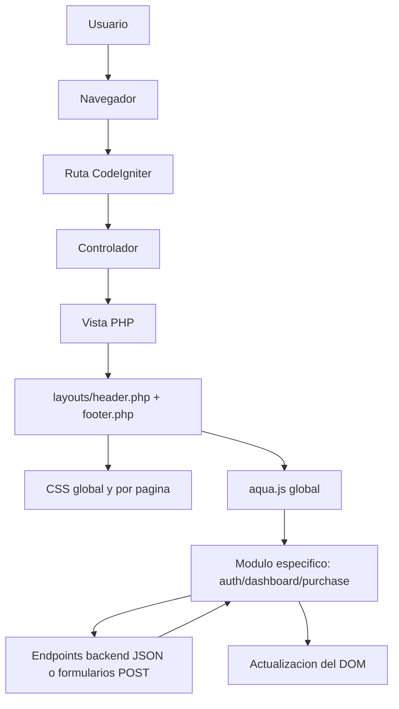
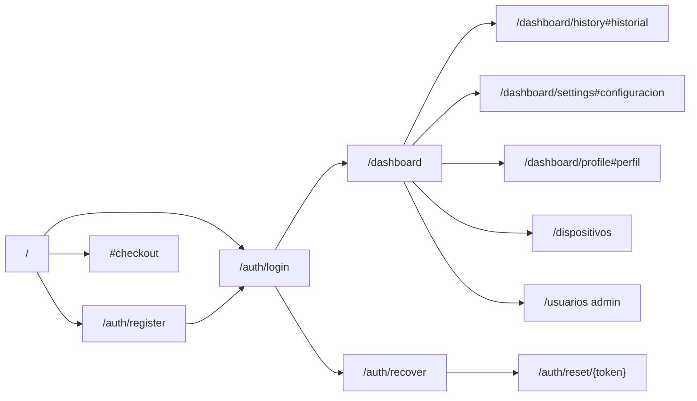
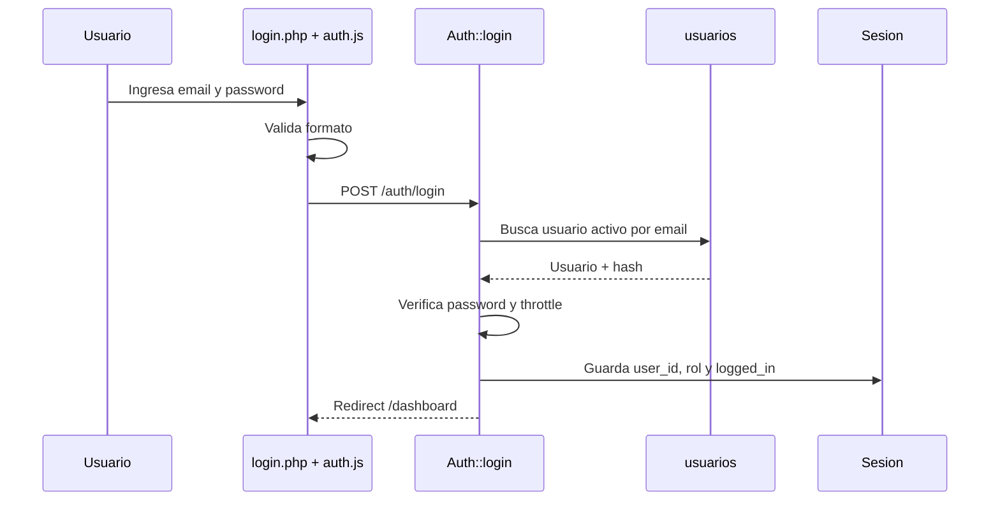
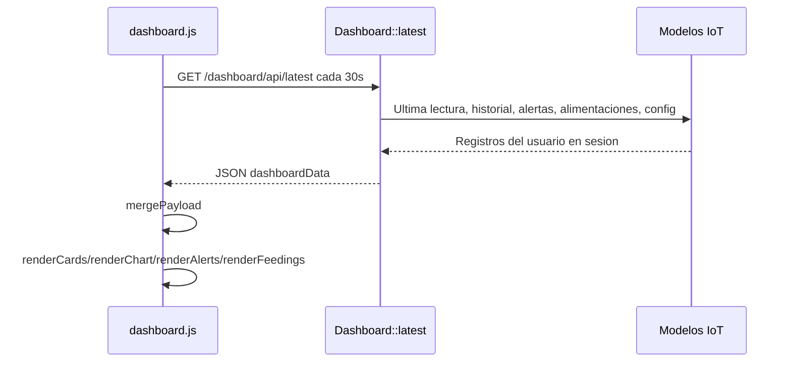
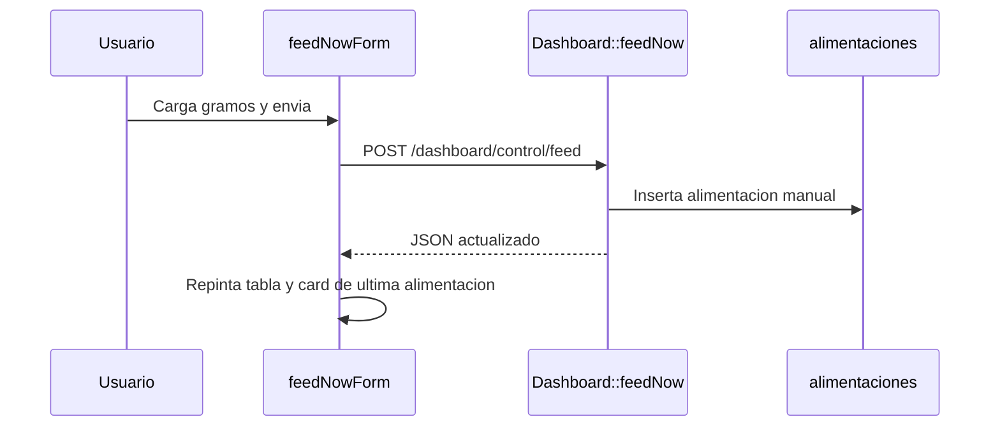
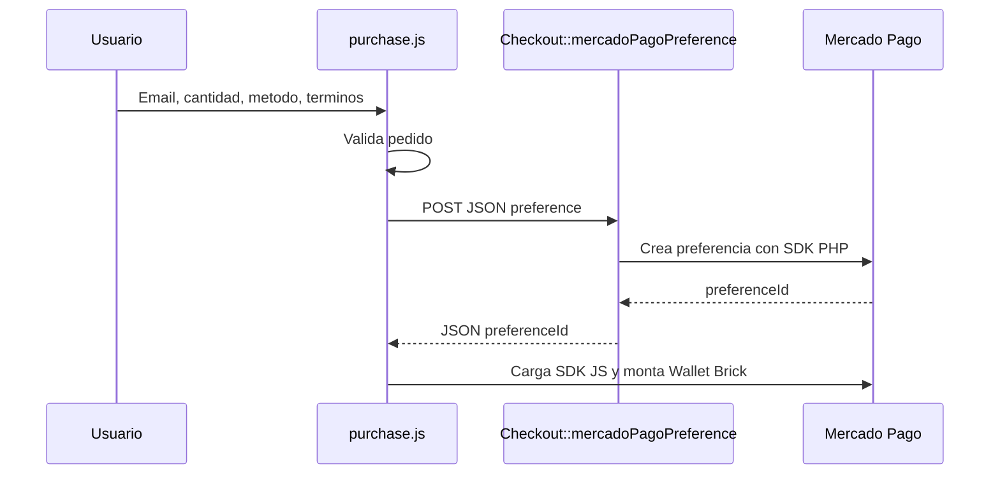

# FRONTEND_DOCUMENTACION

## Resumen general

AquaControl es una aplicacion web renderizada en servidor con CodeIgniter 4. El frontend no es una SPA: las pantallas se generan con vistas PHP en `app/Views`, reciben datos desde controladores y luego se enriquecen con JavaScript vanilla en `public/js`.

La experiencia se divide en cinco superficies principales:

- Landing publica y checkout del producto AquaControl.
- Autenticacion: registro, login, recuperacion y reseteo de contrasena.
- Dashboard IoT autenticado con metricas, grafico, alertas y controles.
- Gestion de dispositivos del usuario autenticado.
- Gestion de usuarios para administradores.

El estado persistente real vive en backend: sesion, base de datos y configuracion en `.env`. El frontend mantiene solo estado temporal de UI, como tema visual, formularios, datos hidratados del dashboard, resumen de compra y estado de graficos.

## Tecnologias y dependencias frontend

| Tecnologia | Uso |
| --- | --- |
| PHP views de CodeIgniter | Renderizado HTML server-side. |
| HTML5 + CSS3 | Maquetacion, formularios, tablas, dashboard y landing. |
| JavaScript vanilla | Validaciones, loader global, tema, checkout, dashboard en vivo. |
| Chart.js por CDN | Grafico del dashboard IoT en `dashboard/index.php`. |
| Mercado Pago JS SDK | Wallet/Brick de checkout, cargado dinamicamente por `purchase.js`. |
| PayPal JS SDK | Preparado en frontend, cargado dinamicamente si se configuran endpoints. |
| Google Fonts | Importadas desde `public/css/aqua.css`. |
| LocalStorage | Guarda el tema en la clave `aquacontrol-theme`. |

No hay `package.json`, bundler, React, Vue, hooks ni estado centralizado tipo Redux. La arquitectura es de paginas PHP con modulos JS por pantalla.

## Arquitectura frontend



La capa comun esta formada por:

- `app/Views/layouts/header.php`: apertura HTML, assets CSS, loader, fondo visual, navbar.
- `app/Views/layouts/footer.php`: footer de marca y carga de scripts.
- `public/css/aqua.css`: tokens, layout global, landing, formularios y estilos base compartidos.
- `public/js/aqua.js`: tema, loader, validaciones globales, animaciones y comportamientos comunes.

Cada controlador agrega assets mediante `extraCss` y `extraJs`. Por ejemplo, `Dashboard::buildViewData()` carga `css/dashboard.css` y `js/dashboard.js`; `Home::index()` carga `css/purchase.css` y `js/purchase.js`; `Auth` carga `css/auth.css` y `js/auth.js`.

## Estructura de carpetas frontend

```text
app/Views/
  auth/
    login.php
    register.php
    recover.php
    reset.php
  components/
    flash_messages.php
    logout_button.php
  dashboard/
    index.php
  devices/
    index.php
    edit.php
  errors/
    404.php
    cli/
    html/
  home/
    index.php
  layouts/
    header.php
    footer.php
  users/
    index.php
    edit.php
  welcome_message.php

public/
  css/
    aqua.css
    auth.css
    dashboard.css
    management.css
    purchase.css
    components/
      loader.css
      logout-button.css
      payment-button.css
      theme-switch.css
  js/
    aqua.js
    auth.js
    dashboard.js
    purchase.js
  img/
    aquacontrol-product.png
  favicon.ico
```

## Carga de assets por pantalla

| Pantalla | Vista | CSS adicional | JS adicional |
| --- | --- | --- | --- |
| Landing / checkout | `home/index.php` | `payment-button.css`, `purchase.css` | `purchase.js` |
| Auth | `auth/*.php` | `auth.css` | `auth.js` |
| Dashboard | `dashboard/index.php` | `dashboard.css` | `dashboard.js` |
| Dispositivos | `devices/*.php` | `dashboard.css`, `management.css` | ninguno especifico |
| Usuarios | `users/*.php` | `dashboard.css`, `management.css` | ninguno especifico |

`aqua.css`, `loader.css`, `logout-button.css` y `aqua.js` se cargan siempre desde el layout.

## Archivos importantes

### `app/Views/layouts/header.php`

Define la estructura inicial del documento:

- Calcula si hay usuario autenticado con `session()->get('user_id')`.
- Lee `user_role` para mostrar el enlace `Usuarios` solo a administradores.
- Construye enlaces publicos de landing y enlaces privados.
- Inserta un script temprano que aplica `data-theme` antes de cargar CSS para evitar parpadeo de tema.
- Carga CSS global y CSS extra de la pagina.
- Renderiza loader global, fondo acuatico y decoracion visual.
- Renderiza navbar con marca, secciones, usuario activo, links privados y boton de logout.

La navbar es sensible al estado de sesion: los invitados ven login/registro; los usuarios ven dashboard/dispositivos/logout; los administradores tambien ven usuarios.

### `app/Views/layouts/footer.php`

Cierra el layout:

- Renderiza footer institucional.
- Carga `public/js/aqua.js`.
- Carga cada archivo definido en `extraJs`.

Orden importante: `aqua.js` corre antes que los modulos de pagina, por lo que los modulos especificos heredan loader, tema y utilidades globales.

### `app/Views/components/flash_messages.php`

Componente reutilizable para mensajes flash:

- Lee `error`, `success` e `info` desde sesion.
- Permite limitar tipos con `$types`.
- Escapa el texto con `esc()`.
- Usa clases visuales `flash-error`, `flash-success` y `flash-info`.

### `app/Views/components/logout_button.php`

Boton reutilizable de cierre de sesion. Por defecto apunta a `auth/logout` y permite cambiar `href`, `label`, `ariaLabel` y clases.

### `app/Views/home/index.php`

Es la landing publica y el checkout. Su logica frontend incluye:

- Lee `$purchase` armado por `Home::index()`.
- Calcula precio formateado si existe `commerce.unitPrice`.
- Define contenido visual: galeria, features, beneficios, comparativa, testimonios y planes.
- Crea un JSON en `<script id="purchase-data" type="application/json">`.
- Renderiza `purchaseForm`, con email, cantidad, metodo de pago, terminos, resumen y contenedores para SDKs.

El payload hidratado tiene esta forma:

```json
{
  "product": {
    "sku": "aquacontrol",
    "name": "AquaControl",
    "unitPrice": 130000,
    "currency": "ARS",
    "maxQuantity": 6
  },
  "payment": {
    "locale": "es-AR",
    "mercadoPagoPublicKey": "...",
    "mercadoPagoPreferenceUrl": "http://.../checkout/mercadopago/preference",
    "paypalClientId": "",
    "paypalCreateOrderUrl": "",
    "paypalCaptureOrderUrl": ""
  }
}
```

No se documentan valores sensibles: el ejemplo muestra solo forma y proposito.

### `app/Views/auth/login.php`

Formulario de login:

- POST a `auth/login`.
- Incluye `csrf_field()`.
- Campos `email`, `password` y checkbox visual `remember`.
- Usa `data-auth-form="login"` para que `auth.js` aplique validacion.
- Incluye boton para mostrar/ocultar contrasena manejado por `aqua.js`.

El checkbox `remember` existe en UI, pero no hay logica backend que cree una sesion persistente o token remember-me.

### `app/Views/auth/register.php`

Formulario de alta:

- POST a `auth/register`.
- Campos: nombre, email, password, confirmacion y terminos.
- Incluye medidor de fortaleza visual.
- Usa validacion cliente en `auth.js` y tambien validaciones globales heredadas de `aqua.js`.
- El backend valida unicidad de email y reglas fuertes de password.

### `app/Views/auth/recover.php`

Formulario de recuperacion:

- POST a `auth/recover`.
- Solicita email.
- El backend responde con mensaje neutral aunque el email no exista, para no revelar cuentas registradas.

### `app/Views/auth/reset.php`

Formulario de nueva contrasena:

- POST a `auth/reset`.
- Incluye token hidden.
- Solicita password y confirmacion.
- Usa medidor y validacion cliente.

### `app/Views/dashboard/index.php`

Vista principal autenticada. Es la pantalla mas importante del frontend:

- Recibe `$dashboardData` desde `Dashboard::buildViewData()`.
- Calcula salud del ecosistema del lado servidor para el primer render.
- Renderiza sidebar con secciones internas: panel, historial, configuracion, cuenta, dispositivos y usuarios si es admin.
- Renderiza panel en vivo:
  - temperatura,
  - pH,
  - alertas,
  - salud del ecosistema,
  - grafico `canvas#ecosystemChart`,
  - estado de agua, alimentacion y modo vacaciones.
- Renderiza lista de alertas no leidas.
- Renderiza tabla de ultimas alimentaciones.
- Renderiza formularios de control: alimentar ahora, modo vacaciones, temperatura objetivo.
- Renderiza formulario de perfil.
- Hidrata JavaScript con `<script id="dashboard-data">`.
- Carga Chart.js desde CDN.
- Declara `window.aquaDashboardHandledByModule = true` para que el bloque viejo de dashboard dentro de `aqua.js` no tome control.

### `app/Views/devices/index.php`

Pantalla de dispositivos del usuario:

- Formulario POST `dispositivos/nuevo`.
- Tabla de dispositivos existentes.
- Acciones editar/eliminar.
- Eliminar usa un `confirm()` nativo y POST a `dispositivos/eliminar/{id}`.
- Incluye `csrf_field()` en formularios.

### `app/Views/devices/edit.php`

Formulario de edicion de dispositivo:

- POST a `dispositivos/editar/{id}`.
- Precarga nombre, tipo y ubicacion.
- Mantiene sidebar de dashboard para navegacion consistente.

### `app/Views/users/index.php`

Pantalla administrativa:

- Lista usuarios registrados.
- Muestra nombre, email, rol, estado y accion editar.
- Solo accesible por filtro backend `role:administrador`.

### `app/Views/users/edit.php`

Formulario administrativo de usuario:

- Permite cambiar nombre, rol y opcionalmente password.
- El email se muestra readonly.
- El backend impide dejar el sistema sin administradores activos.

### `app/Views/errors/404.php`

Error 404 personalizado para rutas no encontradas. Usa layout comun y boton al inicio.

### `app/Views/welcome_message.php`

Vista starter de CodeIgniter. No esta conectada a `Home::index()` actual y funciona como codigo remanente.

## JavaScript

### `public/js/aqua.js`

Modulo global. Responsabilidades:

- Tema:
  - Lee/escribe `localStorage['aquacontrol-theme']`.
  - Aplica `document.documentElement.dataset.theme`.
  - Dispara evento `themechange`.
- Loader:
  - Muestra overlay en navegacion interna y submits.
  - Envuelve `window.fetch` para mostrar loader mientras hay peticiones.
  - Usa timeout de seguridad de 9 segundos.
- Formularios auth:
  - Toggle de password.
  - Medidor de fortaleza.
  - Validaciones cliente para register/login/recover/reset.
- Mensajes flash:
  - Auto-oculta `.flash` luego de 5 segundos.
- Landing:
  - Animaciones por `IntersectionObserver`.
  - Demo falsa de metricas en vivo.
  - Carrusel horizontal de testimonios.
- Dashboard legacy:
  - Existe un bloque que puede renderizar dashboard si hay `#dashboard-data`, pero queda desactivado cuando `window.aquaDashboardHandledByModule` es true.

### `public/js/auth.js`

Modulo especifico de autenticacion:

- Vincula formularios con `data-auth-form`.
- Valida email.
- Valida password fuerte: longitud, mayuscula, minuscula, numero y caracter especial.
- Controla feedback visual de campos.
- Actualiza medidor de fortaleza.
- Agrega feedback live a email y confirmacion de registro.

### `public/js/dashboard.js`

Modulo principal del dashboard. Flujo:

1. Lee JSON de `#dashboard-data`.
2. Guarda estado mutable local en `state`.
3. Inicializa Chart.js sobre `#ecosystemChart`.
4. Renderiza cards, resumen, alertas, tabla de alimentaciones, config y timestamp.
5. Atiende acciones:
   - marcar alerta leida,
   - alimentar ahora,
   - alternar modo vacaciones,
   - guardar temperatura objetivo.
6. Cada 30 segundos llama a `dashboard/api/latest`.
7. Mezcla el payload recibido en `state` y repinta la UI.

Ejemplo de estado que espera:

```json
{
  "config": {},
  "cards": {},
  "alerts": [],
  "feedings": [],
  "charts": {
    "labels": [],
    "temperature": [],
    "ph": []
  },
  "latestTimestamp": null,
  "endpoints": {
    "latest": "...",
    "feed": "...",
    "vacationToggle": "...",
    "targetTemperature": "...",
    "markAlertTemplate": "..."
  }
}
```

### `public/js/purchase.js`

Modulo del checkout:

- Lee `#purchase-data`.
- Mantiene cantidad, precio unitario y total.
- Valida email, cantidad, terminos y metodo.
- Carga SDKs externos solo cuando el usuario confirma.
- Para Mercado Pago:
  - llama POST JSON a `checkout/mercadopago/preference`,
  - obtiene `preferenceId`,
  - monta el Brick Wallet.
- Para PayPal:
  - espera `paypalClientId`, `paypalCreateOrderUrl` y `paypalCaptureOrderUrl`,
  - monta botones si los endpoints existen.

PayPal esta preparado del lado cliente, pero el backend actual no define endpoints propios de orden/captura.

## CSS y sistema visual

| Archivo | Responsabilidad |
| --- | --- |
| `aqua.css` | Tokens, reset, navbar, landing, formularios, botones, flash, footer, estilos base y parte de dashboard legacy. |
| `auth.css` | Card centrada para login/registro/recuperacion/reset. |
| `dashboard.css` | Layout sidebar + dashboard, panel live, grafico, alertas, controles y perfil. |
| `management.css` | Layout y tablas para dispositivos y usuarios. |
| `purchase.css` | Checkout modular: cantidad, metodos, resumen, feedback y SDK containers. |
| `loader.css` | Overlay global de carga. |
| `logout-button.css` | Boton animado de logout. |
| `payment-button.css` | Boton de pago usado en landing/checkout. |
| `theme-switch.css` | Estilos de switch de tema, aunque no se detecta control visible en el header actual. |

## Flujo de navegacion



El dashboard usa rutas distintas para activar secciones, pero renderiza la misma vista `dashboard/index.php` y navega a anchors internos.

## Gestion de estado

### Estado server-side

- Sesion de CodeIgniter:
  - `user_id`,
  - `user_email`,
  - `user_nombre`,
  - `user_role`,
  - `logged_in`.
- Flashdata para mensajes y errores.
- Base de datos para usuarios, sensores, alertas, alimentaciones, configuracion y dispositivos.

### Estado client-side

- `localStorage['aquacontrol-theme']`: tema claro/oscuro.
- `dashboard.js`:
  - mantiene `state` hidratado desde backend,
  - lo actualiza con respuestas JSON,
  - repinta DOM y Chart.js.
- `purchase.js`:
  - calcula resumen de compra,
  - monta/desmonta SDKs.
- Formularios:
  - validacion visual y errores temporales.

No existe persistencia local de token, usuario o datos IoT.

## Integracion con APIs

| Trigger frontend | Metodo/ruta | Tipo | Proposito |
| --- | --- | --- | --- |
| Submit checkout Mercado Pago | `POST /checkout/mercadopago/preference` | JSON | Crear preferencia de pago. |
| Callback externo Mercado Pago | `GET /checkout/mercadopago/success` | Redirect | Flash de pago aprobado. |
| Callback externo Mercado Pago | `GET /checkout/mercadopago/failure` | Redirect | Flash de pago rechazado. |
| Callback externo Mercado Pago | `GET /checkout/mercadopago/pending` | Redirect | Flash de pago pendiente. |
| Poll dashboard | `GET /dashboard/api/latest` | JSON | Refrescar payload IoT. |
| Boton "Marcar leida" | `POST /dashboard/alerts/{id}/read` | JSON | Marcar alerta como leida y refrescar dashboard. |
| Form "Alimentar ahora" | `POST /dashboard/control/feed` | form-urlencoded JSON response | Registrar alimentacion manual y refrescar. |
| Boton modo vacaciones | `POST /dashboard/control/vacation-toggle` | JSON | Alternar modo vacaciones. |
| Form temperatura objetivo | `POST /dashboard/control/target-temperature` | form-urlencoded JSON response | Guardar temperatura objetivo. |
| Form perfil | `POST /dashboard/profile` | HTML redirect | Actualizar nombre/email. |
| Auth forms | `POST /auth/*` | HTML redirect | Registro, login, recovery, reset. |
| Dispositivos forms | `POST /dispositivos/*` | HTML redirect | CRUD de dispositivos. |
| Usuarios admin forms | `POST /usuarios/*` | HTML redirect | Edicion administrativa. |

## Ejemplos de flujo de ejecucion

### Login



### Refresco del dashboard



### Alimentar ahora



### Checkout Mercado Pago



## Observaciones y mejoras posibles

- `aqua.js` y `auth.js` duplican validaciones de autenticacion. Conviene dejar una sola fuente para evitar mensajes divergentes y doble manejo de submit.
- `aqua.js` conserva un bloque legacy de dashboard que referencia canvases `temperatureChart` y `phChart`, pero la vista actual usa `ecosystemChart`. Esta desactivado por `window.aquaDashboardHandledByModule`, aun asi puede eliminarse para reducir riesgo.
- Los formularios renderizan `csrf_field()`, pero las peticiones AJAX no envian token CSRF. Si el backend activa CSRF global, esas llamadas fallarian hasta agregar header/token.
- `theme-switch.css` existe, pero no se detecta un control visible con `data-theme-toggle` en el layout actual.
- PayPal esta preparado en UI, pero faltan endpoints backend de crear/capturar orden.
- `Checkout::redirectWithFlash()` redirige a `/#comprar`, pero la landing actual usa `#checkout`; ese anchor podria no posicionar al usuario donde espera.
- Chart.js, Mercado Pago, PayPal SDK y Google Fonts dependen de servicios externos. Si fallan o estan bloqueados, la experiencia queda degradada.
- Hay caracteres con mojibake en varias cadenas visibles o comentarios (`°C`, textos 404, comentarios). Conviene normalizar encoding UTF-8.
- `welcome_message.php` es codigo starter no usado por la app actual.
- El checkbox `Recordarme` del login no tiene implementacion backend.
