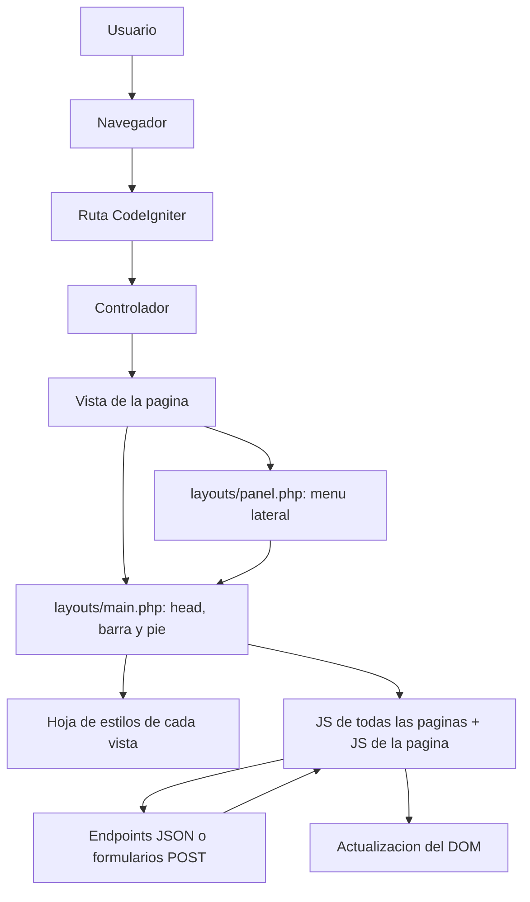
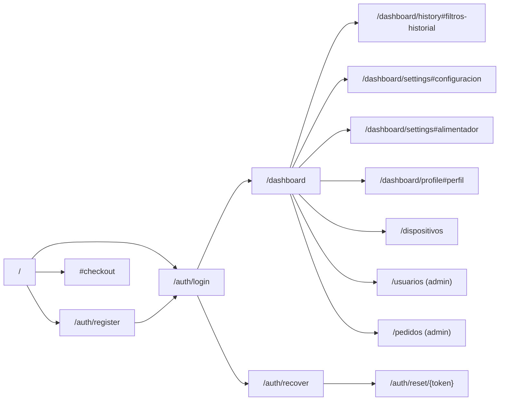
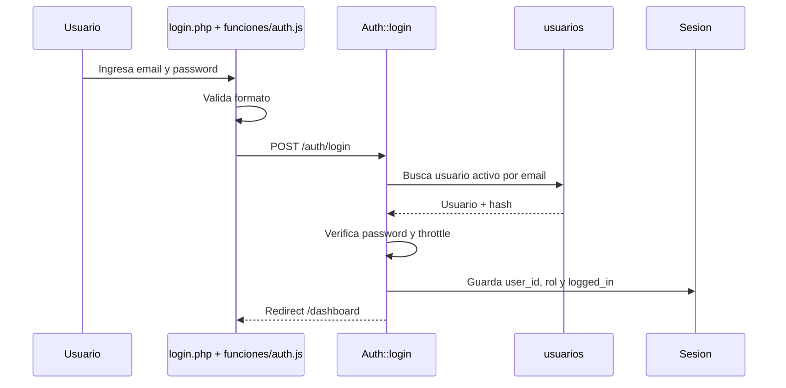
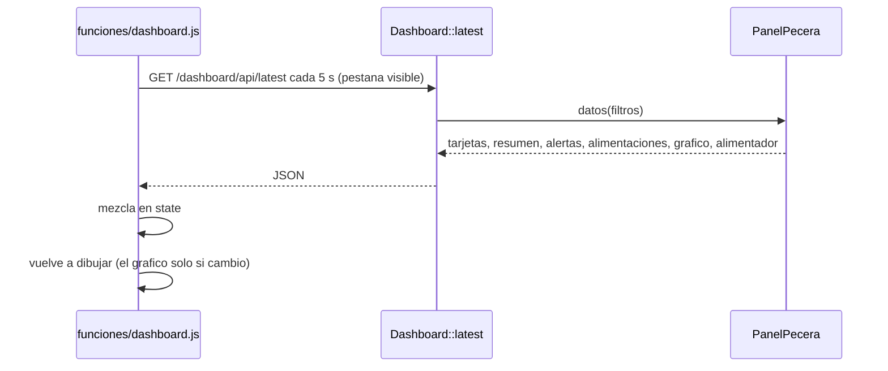
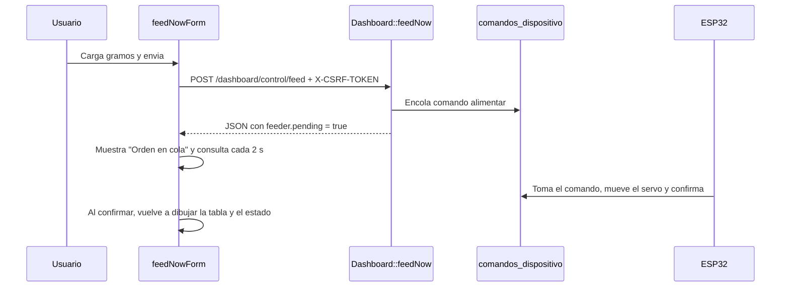
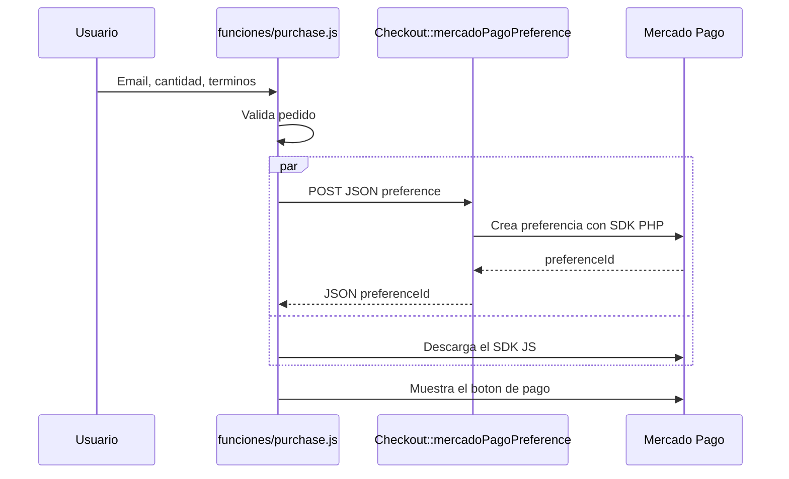

# FRONTEND_DOCUMENTACION

## Resumen general

AquaControl es una aplicacion web renderizada en servidor con CodeIgniter 4. El frontend no es una SPA: las pantallas se generan con vistas PHP en `app/Views`, reciben datos desde controladores y luego se enriquecen con JavaScript vanilla en `public/js`.

La experiencia se divide en cinco superficies principales:

- Portada publica y compra del kit AquaControl.
- Autenticacion: registro, login, recuperacion y reseteo de contrasena.
- Panel de la pecera con metricas, grafico, alertas y controles.
- Gestion de dispositivos del usuario autenticado.
- Gestion de usuarios y pedidos para administradores.

El estado persistente real vive en backend: sesion, base de datos y configuracion en `.env`. El frontend mantiene solo estado temporal de UI: formularios, datos del panel, resumen de compra y el grafico.

## Tecnologias y dependencias frontend

| Tecnologia | Uso |
| --- | --- |
| Vistas PHP de CodeIgniter | Renderizado HTML server-side, con layouts (`extend` / `section`). |
| HTML5 + CSS3 | Maquetacion, formularios, tablas, panel y portada. |
| JavaScript vanilla | Validaciones, cartel de carga, compra, panel en vivo. |
| Chart.js 4 por CDN | Grafico del panel. `animaciones/grafico.js` lo carga recien cuando hace falta. |
| Mercado Pago JS SDK | Boton de pago, cargado por `funciones/purchase.js` al confirmar la compra. |
| Google Fonts | Inter y Poppins, cargadas desde `layouts/main.php` sin frenar el dibujo de la pagina. |

No hay `package.json`, bundler, React ni Vue. La arquitectura es de paginas PHP con su JavaScript separado en dos carpetas: `public/js/funciones/` (lo que hace el trabajo) y `public/js/animaciones/` (lo que es solo visual).

## Arquitectura frontend


```mermaid
flowchart TD
    U[Usuario] --> B[Navegador]
    B --> R[Ruta CodeIgniter]
    R --> C[Controlador]
    C --> V[Vista de la pagina]
    V --> P[layouts/panel.php: menu lateral]
    V --> L[layouts/main.php: head, barra y pie]
    P --> L
    L --> CSS[Hoja de estilos de cada vista]
    L --> JS[JS de todas las paginas + JS de la pagina]
    JS --> API[Endpoints JSON o formularios POST]
    API --> JS
    JS --> DOM[Actualizacion del DOM]
```

### Como se arma una pagina

Todas las vistas empiezan con `$this->extend(...)` y completan secciones del molde:

- **`layouts/main.php`** es el molde de todas las paginas: `<head>`, barra de navegacion y pie. Secciones: `contenido` (obligatoria), `cabecera` (etiquetas extra para el `<head>`) y `scripts` (opcionales).
- **`layouts/panel.php`** extiende a `main` y agrega el menu lateral. Lo usan el panel, Dispositivos, Usuarios y Pedidos. Secciones: `lateral` (titulo sobre el menu), `panel` (contenido) y `scripts`.
- **`layouts/auth.php`** extiende a `main` y pone la tarjeta centrada de las pantallas de cuenta (login, registro, recuperar y nueva contrasena), ademas de cargar `funciones/auth.js`. Seccion: `tarjeta`.

Cada vista pide sus propios archivos: su hoja de estilos con `usar_css()` en la primera linea (ver "CSS y sistema visual") y su `<script>` en la seccion `scripts`. Los controladores no saben nada de CSS ni de JS.

Ejemplo minimo de una pagina nueva del panel (`app/Views/mi_carpeta/mi_pagina.php`, con sus estilos en `public/css/mi_carpeta/mi_pagina.css`):

```php
<?php usar_css('css/mi_carpeta/mi_pagina.css') ?>
<?= $this->extend('layouts/panel') ?>

<?= $this->section('lateral') ?>
  <h1>Mi pagina</h1>
<?= $this->endSection() ?>

<?= $this->section('panel') ?>
  <p>Contenido.</p>
<?= $this->endSection() ?>
```

Si la pagina necesita JavaScript, sus `<script>` van en la seccion `scripts`, separados por lo que hacen: el codigo que hace el trabajo en `public/js/funciones/` y lo que es solo visual en `public/js/animaciones/` (ver "JavaScript").

## Estructura de carpetas frontend

```text
app/Views/
  layouts/
    main.php                    (molde de todas las paginas)
    panel.php                   (molde con menu lateral)
    auth.php                    (molde de las pantallas de cuenta)
  components/
    flash_messages.php          (mensajes de exito / error / aviso)
    logout_button.php           (boton "Salir")
    campo_password.php          (campo de contrasena con el ojito)
  home/
    index.php                   (portada: lista de secciones en orden)
    secciones/
      hero.php                  (titulo principal y botones)
      producto.php              (galeria)
      caracteristicas.php
      como_funciona.php         (pasos)
      beneficios.php
      demo.php                  (panel de muestra)
      comparacion.php
      testimonios.php           (carrusel)
      planes.php
      compra.php                (formulario de compra)
  auth/
    login.php
    register.php
    recover.php
    reset.php
  dashboard/
    index.php                   (panel: lista de partes en orden)
    partes/
      filtros.php               (filtros del historial)
      en_vivo.php               (tarjetas y grafico)
      alertas_y_alimentaciones.php
      control.php               (modo vacaciones y temperatura objetivo)
      alimentador.php           (alimentar ahora y horarios)
      perfil.php                (mi cuenta)
  devices/
    index.php
    edit.php
  users/
    index.php
    edit.php
  orders/
    index.php
  emails/
    recuperar_contrasena.php    (cuerpo del email de recuperacion)
  errors/
    404.php

public/
  css/                          (una hoja por vista, con su misma ruta y nombre)
    layouts/
      main.css                  (global: colores, base, barra, botones, formularios, pie)
      panel.css                 (menu lateral y lo comun de las paginas del panel)
      auth.css                  (tarjeta centrada de las pantallas de cuenta)
    components/
      flash_messages.css
      logout_button.css
      campo_password.css
    home/
      index.css                 (lo que comparten varias secciones de la portada)
      secciones/                (hero.css, producto.css, ... una por seccion)
    auth/
      login.css, register.css, recover.css, reset.css
    dashboard/
      index.css                 (lo que comparten varias partes del panel)
      partes/                   (filtros.css, en_vivo.css, ... una por parte)
    devices/
      index.css, edit.css
    users/
      index.css, edit.css
    orders/
      index.css
    errors/
      404.css
  js/
    funciones/                  (lo que hace el trabajo: datos, formularios, servidor)
      aqua.js                   (todas las paginas)
      auth.js
      dashboard.js
      purchase.js
    animaciones/                (lo que es solo visual)
      generales.js              (todas las paginas)
      portada.js
      grafico.js
  img/
    aquacontrol-product.webp
  favicon.ico
```

## Carga de assets por pantalla

| Pantalla | Vista | Molde | CSS (ademas de `layouts/main.css`) | JS propio |
| --- | --- | --- | --- | --- |
| Portada / compra | `home/index.php` | `main` | `home/index.css` y una hoja por seccion (`home/secciones/*.css`) | `animaciones/portada.js` y `funciones/purchase.js` |
| Cuentas | `auth/*.php` | `auth` | `layouts/auth.css`, `components/campo_password.css` y la de la vista (`auth/login.css`, ...) | `funciones/auth.js` |
| Panel de la pecera | `dashboard/index.php` | `panel` | `layouts/panel.css`, `dashboard/index.css` y una hoja por parte (`dashboard/partes/*.css`) | `animaciones/grafico.js` y `funciones/dashboard.js` |
| Dispositivos | `devices/*.php` | `panel` | `layouts/panel.css` y `devices/index.css` o `devices/edit.css` | ninguno |
| Usuarios | `users/*.php` | `panel` | `layouts/panel.css` y `users/index.css` o `users/edit.css` | ninguno |
| Pedidos | `orders/index.php` | `panel` | `layouts/panel.css` y `orders/index.css` | ninguno |
| 404 | `errors/404.php` | `main` | `errors/404.css` | ninguno |

`layouts/main.css`, `funciones/aqua.js` y `animaciones/generales.js` se cargan siempre desde `layouts/main.php`. Las hojas de los componentes (`components/*.css`) se cargan solo en las paginas donde aparece el componente.

## Archivos importantes

### `app/Views/layouts/main.php`

Define la estructura del documento:

- Calcula si hay usuario autenticado y si es administrador.
- `<meta name="csrf-token">` y `<meta name="csrf-header">`: de ahi saca `funciones/aqua.js` el token para los pedidos AJAX.
- Un script de una linea agrega la clase `js` a `<html>` (las animaciones de aparicion solo se aplican si hay JavaScript).
- Tipografias con `media="print" onload="this.media='all'"`: se descargan sin frenar el primer dibujo de la pagina.
- `enlaces_css()` escribe los `<link>` de las hojas de estilo que pidieron las vistas de esa pagina.
- Cartel de "cargando" (`[data-page-loader]`), oculto hasta que `animaciones/generales.js` lo muestra.
- Barra de navegacion: los invitados ven login/registro; los usuarios ven panel, dispositivos y salir; los administradores tambien ven usuarios y pedidos.
- Pie de pagina.
- Carga `funciones/aqua.js`, `animaciones/generales.js` y despues la seccion `scripts` de la pagina.

Orden importante: esos dos corren antes que el JS de la pagina, que puede usar `window.AquaCsrf` (de `funciones/aqua.js`) y `window.AquaLoader` (de `animaciones/generales.js`).

### `app/Views/layouts/panel.php`

Menu lateral del panel. El link activo se marca solo con `url_is()` segun la direccion. Muestra los mensajes flash arriba del contenido.

### `app/Views/layouts/auth.php`

Tarjeta centrada de las pantallas de cuenta. Cada pantalla completa la seccion `tarjeta` con su logo, sus mensajes y su formulario. Tambien carga `funciones/auth.js`.

### `app/Views/components/flash_messages.php`

Muestra los mensajes de un solo uso que deja el controlador con `->with('success' | 'error' | 'info', '...')`. Escapa el texto con `esc()`. `animaciones/generales.js` los desvanece a los 5 segundos.

### `app/Views/components/logout_button.php`

Boton "Salir". Es un `<form method="POST">` con `csrf_field()` hacia `auth/logout` (el logout no acepta GET).

### `app/Views/components/campo_password.php`

Campo de contrasena con el boton para mostrarla. Variables: `$nombre`, `$placeholder`, `$autocomplete` y `$medidor` (`true` agrega la barra de seguridad). Pasar siempre `medidor` de forma explicita:

```php
<?= view('components/campo_password', ['nombre' => 'password', 'placeholder' => 'Tu contrasena', 'autocomplete' => 'current-password', 'medidor' => false]) ?>
```

### Ayudas de formulario (`app/Helpers/formulario_helper.php`)

Disponibles en todas las vistas:

- `error_campo($errors, 'email')`: cajita roja con el error de ese campo (oculta si no hay error).
- `clase_error($errors, 'email')`: devuelve ` is-invalid` para pintar el borde del campo.
- `set_value('email')` y `set_checkbox('terms', '1')` (de CodeIgniter): conservan lo que el usuario habia escrito si el formulario vuelve con errores.

### Ayudas de estilos (`app/Helpers/estilos_helper.php`)

Disponibles en todas las vistas:

- `usar_css('css/auth/login.css')`: va en la primera linea de cada vista y anota su hoja de estilos. No escribe nada.
- `enlaces_css()`: lo llama `layouts/main.php` dentro del `<head>` y escribe un `<link>` por cada hoja anotada. No repite una hoja aunque el componente aparezca dos veces.

### `app/Views/home/index.php` y `home/secciones/`

La portada es una lista de `include`, una linea por seccion. Para mover una seccion se cambia el orden de las lineas; para sacarla se borra su linea.

Recibe de `Home::index()`:

- `$producto`: datos ya listos para mostrar (nombre, precio formateado, cantidad maxima, mensaje de entrega).
- `$compra`: se imprime como JSON en `<script id="purchase-data">` para `funciones/purchase.js`.

```json
{
  "product": {
    "sku": "aquacontrol",
    "name": "AquaControl",
    "unitPrice": 130000,
    "currency": "ARS",
    "maxQuantity": 6
  },
  "payment": {
    "locale": "es-AR",
    "mercadoPagoPublicKey": "...",
    "mercadoPagoPreferenceUrl": "http://.../checkout/mercadopago/preference"
  }
}
```

No se documentan valores sensibles: el ejemplo muestra solo forma y proposito.

La imagen del producto es `img/aquacontrol-product.webp` (unos 95 KB). Se precarga con `<link rel="preload">` porque es lo primero que se ve.

### `app/Views/auth/*.php`

Los cuatro formularios (`login`, `register`, `recover`, `reset`) tienen la misma forma:

- Extienden `layouts/auth` y completan la seccion `tarjeta`.
- POST a `auth/...` con `csrf_field()`.
- `data-auth-form="login|register|recover|reset"` para que `funciones/auth.js` los valide antes de enviar.
- Errores del servidor con `error_campo()`.

Detalles:

- `login.php`: el checkbox "Recordarme" es solo visual; no hay logica de sesion persistente.
- `register.php`: incluye medidor de seguridad de la contrasena y aceptacion de terminos.
- `recover.php`: el backend responde con un mensaje neutral aunque el email no exista.
- `reset.php`: lleva el token en un campo oculto.

### `app/Views/dashboard/index.php` y `dashboard/partes/`

Es la pantalla mas importante. La usan las cuatro direcciones del panel (principal, historial, configuracion y mi cuenta); en Historial se agrega la parte `filtros`.

- `filtros.php`: formulario GET con Desde, Hasta y Dispositivo, y la cantidad de lecturas del rango.
- `en_vivo.php`: temperatura, pH, alertas, estado del ecosistema, grafico `canvas#ecosystemChart` y estado de agua, alimentacion y modo vacaciones.
- `alertas_y_alimentaciones.php`: alertas sin leer y tabla de las ultimas alimentaciones.
- `control.php`: modo vacaciones y temperatura objetivo.
- `alimentador.php`: estado del ESP32 (conectado, offline, orden en curso, ultima orden), "Alimentar ahora" y horarios con gramos por racion.
- `perfil.php`: formulario "Mi cuenta" (lo guarda el controlador `Perfil`).

Los datos llegan en `$dashboardData` y se imprimen como JSON en `<script id="dashboard-data">`. El primer dibujo lo hace PHP con esos mismos datos; despues `funciones/dashboard.js` los va refrescando.

### `app/Views/devices/index.php`

Pantalla de dispositivos del usuario:

- Formulario POST `dispositivos/nuevo`.
- Tabla de dispositivos existentes, con el prefijo de la API key y la ultima conexion.
- Acciones editar/eliminar y generar/regenerar/revocar API key.
- Las acciones delicadas piden confirmacion con el atributo `data-confirm="..."` en el `<form>` (lo atiende `funciones/aqua.js`).
- Tras generar una key muestra un panel (`#api-key-nueva`) con la key completa (una sola vez), boton Copiar (`data-copy-target`) y ejemplo de request.

### `app/Views/devices/edit.php`

Formulario de edicion de dispositivo (POST a `dispositivos/editar/{id}`), con nombre, tipo y ubicacion precargados.

### `app/Views/users/index.php` y `users/edit.php`

Pantallas administrativas (filtro `auth:administrador`):

- Lista de usuarios con nombre, email, rol, estado y accion editar.
- Edicion de nombre, rol y, opcionalmente, password. El email se muestra readonly.
- El backend impide dejar el sistema sin administradores activos.

### `app/Views/orders/index.php`

Pantalla administrativa de pedidos:

- Resumen de aprobados (cantidad y monto) y pendientes.
- Filtros por estado (`?estado=`) con contador por estado.
- Tabla con fecha, referencia, pago de Mercado Pago, cliente, producto, total y estado.
- Marca los pagos cuyo monto no coincide con el pedido para revision manual.

### `app/Views/errors/404.php`

Error 404 personalizado para rutas no encontradas. Usa el molde comun y un boton al inicio.

## JavaScript

El JavaScript esta separado en dos carpetas segun para que sirve:

| Carpeta | Que hay | Regla |
| --- | --- | --- |
| `public/js/funciones/` | El codigo que hace el trabajo: lee formularios, valida, calcula y habla con el servidor. | No tiene colores, iconos, animaciones ni estilos. Para cambiar como se ve algo solo pone o saca una clase (`is-invalid`, `is-showing`) o anota un dato (`data-score`). |
| `public/js/animaciones/` | Lo que es solo visual: lo que aparece, se mueve, se desvanece o se dibuja. | No toca datos ni habla con el servidor. |

El aspecto (colores, tamanos, transiciones) va siempre en el CSS de la vista; los iconos van en la vista.

| Archivo | Se carga en | Desde |
| --- | --- | --- |
| `funciones/aqua.js` | todas las paginas | `layouts/main.php` |
| `animaciones/generales.js` | todas las paginas | `layouts/main.php` |
| `funciones/auth.js` | pantallas de cuenta | `layouts/auth.php` |
| `animaciones/portada.js` | portada | `home/index.php` |
| `funciones/purchase.js` | portada | `home/index.php` |
| `animaciones/grafico.js` | panel de la pecera | `dashboard/index.php` |
| `funciones/dashboard.js` | panel de la pecera | `dashboard/index.php` |

### `public/js/funciones/aqua.js`

Se carga en todas las paginas. Responsabilidades:

- **`window.AquaCsrf`**: `headers()` devuelve el header `X-CSRF-TOKEN` para un `fetch`; `refresh(response)` guarda el token nuevo que devuelve el servidor (cambia en cada POST) y lo actualiza tambien en los formularios de la pagina.
- **`data-confirm`**: un `<form data-confirm="Seguro?">` pide confirmacion antes de enviarse.
- **`data-copy-target="id"`**: boton que copia el texto de ese elemento.

### `public/js/animaciones/generales.js`

Se carga en todas las paginas. Solo cosas visuales:

- **`window.AquaLoader`**: `mostrar()` y `ocultar()` el cartel de "cargando". Aparece solo si la espera pasa de 300 ms, asi en las cargas rapidas no se ve. Se muestra al hacer clic en un link interno y al enviar un formulario (salvo que tenga `data-skip-loader="true"`).
- **Mensajes flash**: a los 5 segundos les pone la clase `is-leaving` (el desvanecido esta en `components/flash_messages.css`) y medio segundo despues los quita.

### `public/js/animaciones/portada.js`

Animaciones de la portada:

- **`data-reveal`**: los elementos aparecen cuando entran en pantalla (`IntersectionObserver`).
- **Demo de la portada**: numeros de ejemplo que cambian cada 2,8 s (se pausa con la pestana oculta).
- **Carrusel de testimonios**: botones anterior/siguiente.

### `public/js/funciones/auth.js`

Paginas de cuenta:

- Vincula formularios con `data-auth-form`.
- Valida email y contrasena segura (longitud, mayuscula, minuscula, numero y caracter especial) antes de enviar.
- Escribe el texto del error en la cajita `.invalid-feedback` de cada campo (el icono de aviso y el ocultarla cuando esta vacia los resuelve `layouts/main.css`).
- Medidor de seguridad: calcula el puntaje (0 a 5) y lo anota en `data-score` de `.strength-bar`; los colores los pone `components/campo_password.css`.
- Boton del ojito: cambia el campo entre `password` y `text` y le pone la clase `is-showing` al boton; el CSS muestra el ojo o el ojo tachado (los dos dibujos estan en `components/campo_password.php`).

El servidor vuelve a validar todo: esto solo avisa antes.

### `public/js/funciones/dashboard.js`

Panel de la pecera. Los textos ya vienen armados desde `PanelPecera.php`; el JS solo los pone en su lugar.

1. Lee el JSON de `#dashboard-data` y lo guarda en `state`.
2. Dibuja tarjetas, resumen, alertas, tabla de alimentaciones, configuracion y estado del alimentador.
3. Le pasa los numeros del grafico a `window.AquaGrafico.dibujar(state.charts)` (ver `animaciones/grafico.js`).
4. Atiende acciones (todas envian el header `X-CSRF-TOKEN` via `window.AquaCsrf`):
   - marcar alerta leida,
   - alimentar ahora (encola la orden para el ESP32 y muestra el mensaje del backend),
   - guardar horarios de alimentacion,
   - alternar modo vacaciones,
   - guardar temperatura objetivo.
5. Vuelve a pedir `dashboard/api/latest` cada 5 segundos, o cada 2 segundos mientras el alimentador tiene una orden en curso. Con la pestana oculta no pide nada y retoma al volver. En Historial, las direcciones incluyen los filtros elegidos para no volver a las 24 h.
6. Mezcla lo recibido en `state` y vuelve a dibujar.

Forma del estado:

```json
{
  "config": {},
  "cards": {},
  "summary": {},
  "alerts": [],
  "feedings": [],
  "charts": { "labels": [], "temperature": [], "ph": [], "count": 0 },
  "feeder": {},
  "latestTimestamp": null,
  "userName": "...",
  "endpoints": {
    "latest": "...",
    "feed": "...",
    "vacationToggle": "...",
    "targetTemperature": "...",
    "feedingSchedule": "...",
    "markAlertTemplate": "..."
  }
}
```

### `public/js/animaciones/grafico.js`

Dibujo del grafico de temperatura y pH del panel (`window.AquaGrafico`). Aca estan los colores, el grosor de las lineas y el cartelito al pasar el mouse.

- Carga Chart.js desde el CDN. Si no carga, el resto del panel igual anda.
- `dibujar(datos)` recibe `{ labels, temperature, ph, count }`. Si los datos no cambiaron no toca el grafico; si cambiaron lo actualiza en el lugar, sin volver a animarlo.
- Tiene que estar antes que `funciones/dashboard.js` en la pagina (asi esta en `dashboard/index.php`).

### `public/js/funciones/purchase.js`

Formulario de compra de la portada:

- Lee `#purchase-data`.
- Mantiene cantidad, precio unitario y total.
- Valida email, cantidad y terminos.
- Al confirmar pide la preferencia (`POST checkout/mercadopago/preference` con el header `X-CSRF-TOKEN`) y carga el SDK de Mercado Pago al mismo tiempo; despues muestra el boton de pago.
- Al volver de Mercado Pago el backend verifica el pago y muestra el resultado como mensaje flash en `#checkout`.

## CSS y sistema visual

Cada vista tiene su propia hoja de estilos en `public/css`, con la misma ruta y el mismo nombre que la vista:

```text
app/Views/auth/login.php              ->  public/css/auth/login.css
app/Views/home/secciones/hero.php     ->  public/css/home/secciones/hero.css
app/Views/layouts/panel.php           ->  public/css/layouts/panel.css
```

La vista la pide en su primera linea:

```php
<?php usar_css('css/auth/login.css') ?>
```

`layouts/main.php` escribe los `<link>` con `enlaces_css()`, de lo mas general a lo mas particular: primero los moldes (`layouts/`), despues los componentes (`components/`) y al final la pagina con sus partes. Por eso una vista puede pisar un estilo de su molde. Una seccion de la portada o una parte del panel que se saca de su `index.php` deja de cargar su hoja.

Donde va cada regla:

| Archivo | Responsabilidad |
| --- | --- |
| `layouts/main.css` | Lo que usan todas las paginas: colores y medidas (`:root`), base, fondo, barra de navegacion, botones, formularios, pie, cartel de carga y animaciones. Tambien el panel "en vivo", porque lo comparten la demo de la portada y el panel real. |
| `layouts/panel.css` | Menu lateral, tarjeta base, y las tablas, formularios y etiquetas que comparten Dispositivos, Usuarios y Pedidos. |
| `layouts/auth.css` | Tarjeta centrada, logo y links de las pantallas de cuenta. |
| `components/*.css` | Los estilos de cada componente (mensajes, boton "Salir", campo de contrasena). |
| `home/index.css` y `dashboard/index.css` | Lo que comparten varias secciones de la portada o varias partes del panel. |
| El resto | Solo lo propio de esa vista. |

Una clase que usa una sola vista va en la hoja de esa vista; una que usan varias va en la hoja de lo que tienen en comun (el `index` de la pagina o el molde). Las vistas que hoy no necesitan estilos propios (`auth/register`, `auth/recover`, `auth/reset`, `devices/edit` y `users/edit`) igual tienen su hoja, con un comentario que dice de donde salen los suyos.

Cada archivo termina con sus reglas para pantallas mas chicas (`@media`).

Los colores se definen una sola vez como variables en `:root`, al principio de `layouts/main.css` (por ejemplo `--aqua-cyan`, el color principal). Cambiar una variable cambia ese color en toda la pagina.

El email de recuperacion (`emails/recuperar_contrasena.php`) no tiene hoja: los programas de correo no cargan archivos CSS, asi que lleva sus estilos escritos en cada etiqueta.

## Rendimiento: decisiones que conviene mantener

- **Imagen de portada en WebP** y precargada.
- **Tipografias** cargadas sin bloquear el dibujo, y solo los pesos que se usan (Inter 400-900, Poppins 500-800).
- **`backdrop-filter` (desenfoque) solo en cuatro lugares**: barra de navegacion, boton secundario de la portada, y dos carteles sobre la foto. Ponerlo en muchas tarjetas sobre un fondo animado hace lenta la pagina.
- **Cartel de carga** que no aparece en cargas rapidas.
- **Barra de depuracion apagada** salvo que se active en `.env` (agregaba miles de elementos a cada pagina).
- **El panel no pide datos con la pestana oculta** y no vuelve a animar el grafico en cada refresco.
- **Chart.js se descarga solo en el panel**, despues de dibujar la pagina.

## Flujo de navegacion


```mermaid
flowchart LR
    Inicio["/"] --> Login["/auth/login"]
    Inicio --> Registro["/auth/register"]
    Inicio --> Checkout["#checkout"]
    Login --> Dashboard["/dashboard"]
    Registro --> Login
    Login --> Recuperar["/auth/recover"]
    Recuperar --> Reset["/auth/reset/{token}"]
    Dashboard --> Historial["/dashboard/history#filtros-historial"]
    Dashboard --> Config["/dashboard/settings#configuracion"]
    Dashboard --> Alimentador["/dashboard/settings#alimentador"]
    Dashboard --> Perfil["/dashboard/profile#perfil"]
    Dashboard --> Dispositivos["/dispositivos"]
    Dashboard --> Usuarios["/usuarios (admin)"]
    Dashboard --> Pedidos["/pedidos (admin)"]
```

El panel usa direcciones distintas para activar secciones, pero dibuja la misma vista `dashboard/index.php` y navega a anclas internas.

## Gestion de estado

### Estado server-side

- Sesion de CodeIgniter:
  - `user_id`,
  - `user_email`,
  - `user_nombre`,
  - `user_role`,
  - `logged_in`.
- Flashdata para mensajes y errores.
- Base de datos para usuarios, sensores, alertas, alimentaciones, configuracion, dispositivos y pedidos.

### Estado client-side

- `funciones/dashboard.js`:
  - mantiene `state` con lo que mando el backend,
  - lo actualiza con cada respuesta JSON,
  - vuelve a dibujar el DOM y le pasa los numeros al grafico.
- `funciones/purchase.js`:
  - calcula el resumen de compra,
  - monta el boton de Mercado Pago.
- Formularios:
  - validacion visual y errores temporales.

No se guarda nada en el navegador (ni token, ni usuario, ni datos de la pecera).

## Integracion con APIs

| Trigger frontend | Metodo/ruta | Tipo | Proposito |
| --- | --- | --- | --- |
| Confirmar compra | `POST /checkout/mercadopago/preference` | JSON | Crear preferencia de pago. |
| Regreso de Mercado Pago | `GET /checkout/mercadopago/success` | Redirect | Flash de pago aprobado. |
| Regreso de Mercado Pago | `GET /checkout/mercadopago/failure` | Redirect | Flash de pago rechazado. |
| Regreso de Mercado Pago | `GET /checkout/mercadopago/pending` | Redirect | Flash de pago pendiente. |
| Refresco del panel | `GET /dashboard/api/latest` | JSON | Datos actualizados. |
| Boton "Marcar leida" | `POST /dashboard/alerts/{id}/read` | JSON | Marcar alerta como leida. |
| Form "Alimentar ahora" | `POST /dashboard/control/feed` | form-urlencoded, responde JSON | Encolar la orden para el ESP32. |
| Form horarios | `POST /dashboard/control/feeding-schedule` | form-urlencoded, responde JSON | Guardar horarios y gramos. |
| Boton modo vacaciones | `POST /dashboard/control/vacation-toggle` | JSON | Alternar modo vacaciones. |
| Form temperatura objetivo | `POST /dashboard/control/target-temperature` | form-urlencoded, responde JSON | Guardar temperatura objetivo. |
| Form "Mi cuenta" | `POST /dashboard/profile` | HTML redirect | Actualizar nombre/email. |
| Formularios de cuenta | `POST /auth/*` | HTML redirect | Registro, login, recuperar, reset. |
| Formularios de dispositivos | `POST /dispositivos/*` | HTML redirect | ABM de dispositivos y API keys. |
| Formulario de usuarios | `POST /usuarios/editar/{id}` | HTML redirect | Edicion administrativa. |

## Ejemplos de flujo de ejecucion

### Login


```mermaid
sequenceDiagram
    participant U as Usuario
    participant F as login.php + funciones/auth.js
    participant B as Auth::login
    participant DB as usuarios
    participant S as Sesion
    U->>F: Ingresa email y password
    F->>F: Valida formato
    F->>B: POST /auth/login
    B->>DB: Busca usuario activo por email
    DB-->>B: Usuario + hash
    B->>B: Verifica password y throttle
    B->>S: Guarda user_id, rol y logged_in
    B-->>F: Redirect /dashboard
```

### Refresco del panel


```mermaid
sequenceDiagram
    participant F as funciones/dashboard.js
    participant API as Dashboard::latest
    participant P as PanelPecera
    F->>API: GET /dashboard/api/latest cada 5 s (pestana visible)
    API->>P: datos(filtros)
    P-->>API: tarjetas, resumen, alertas, alimentaciones, grafico, alimentador
    API-->>F: JSON
    F->>F: mezcla en state
    F->>F: vuelve a dibujar (el grafico solo si cambio)
```

### Alimentar ahora


```mermaid
sequenceDiagram
    participant U as Usuario
    participant F as feedNowForm
    participant API as Dashboard::feedNow
    participant Q as comandos_dispositivo
    participant E as ESP32
    U->>F: Carga gramos y envia
    F->>API: POST /dashboard/control/feed + X-CSRF-TOKEN
    API->>Q: Encola comando alimentar
    API-->>F: JSON con feeder.pending = true
    F->>F: Muestra "Orden en cola" y consulta cada 2 s
    E->>Q: Toma el comando, mueve el servo y confirma
    F->>F: Al confirmar, vuelve a dibujar la tabla y el estado
```

### Compra con Mercado Pago


```mermaid
sequenceDiagram
    participant U as Usuario
    participant F as funciones/purchase.js
    participant API as Checkout::mercadoPagoPreference
    participant MP as Mercado Pago
    U->>F: Email, cantidad, terminos
    F->>F: Valida pedido
    par
        F->>API: POST JSON preference
        API->>MP: Crea preferencia con SDK PHP
        MP-->>API: preferenceId
        API-->>F: JSON preferenceId
    and
        F->>MP: Descarga el SDK JS
    end
    F->>MP: Muestra el boton de pago
```

## Observaciones y mejoras posibles

- En celulares la barra de arriba solo muestra el logo y "Registrarse" (o "Salir"): los links "Iniciar sesion", "Panel principal" y "Dispositivos" se ocultan por debajo de 768 px y no hay menu desplegable.
- Chart.js, Mercado Pago y Google Fonts dependen de servicios externos. Si fallan o estan bloqueados, la experiencia queda degradada (sin grafico, sin boton de pago o con la tipografia del sistema).
- El checkbox "Recordarme" del login no tiene implementacion backend.
- Los links de redes del pie (`wa.me`, Instagram, GitHub) y el de "terminos y condiciones" del registro son genericos: falta poner los reales.
